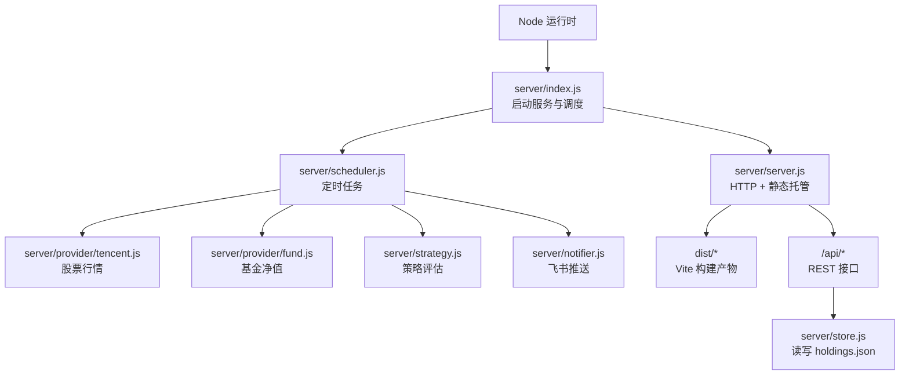
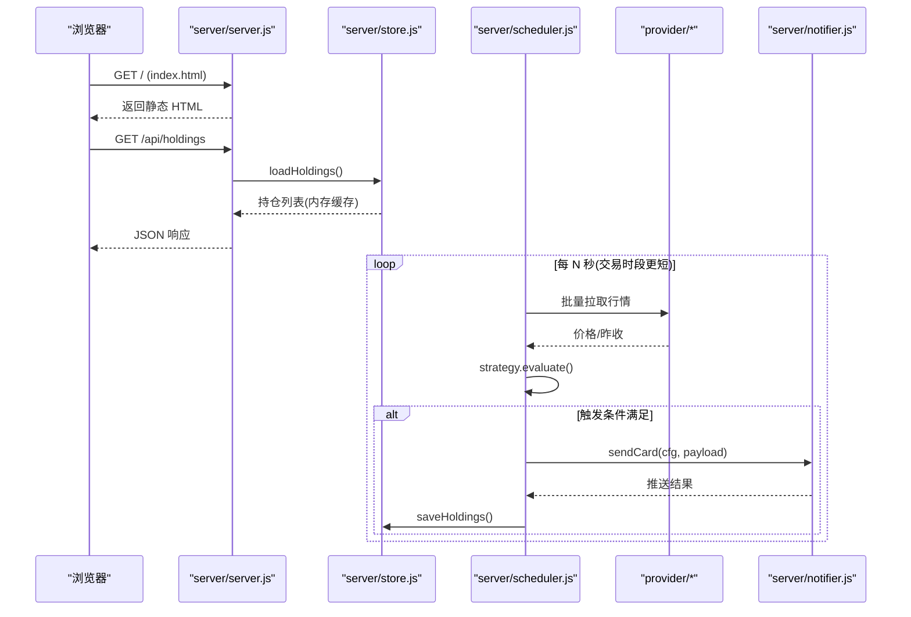
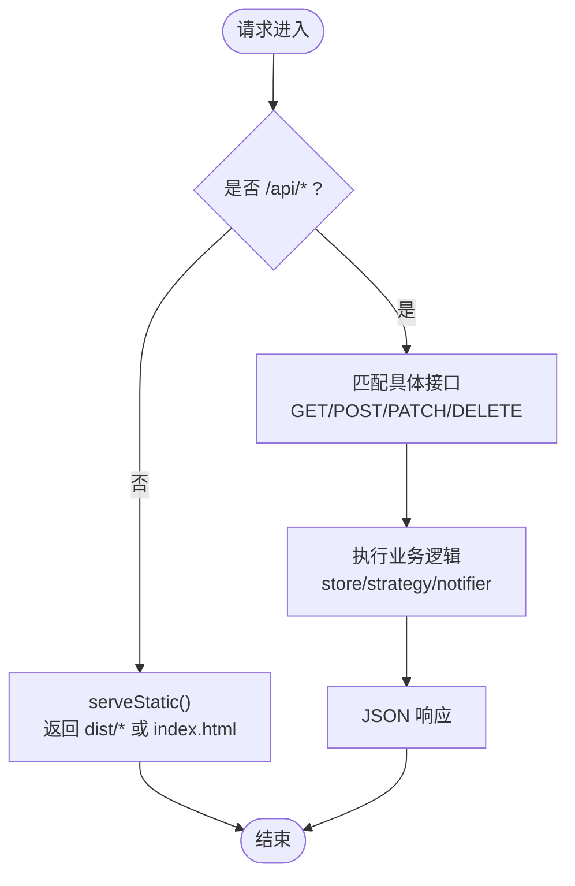
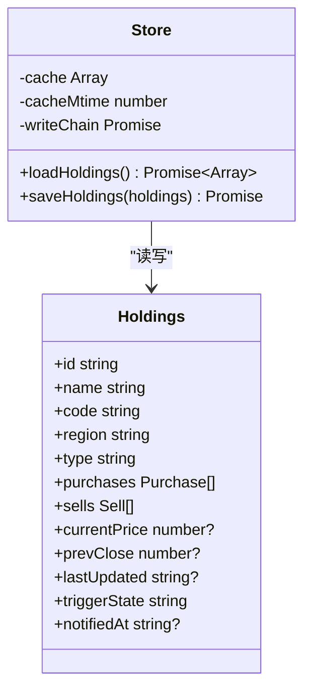
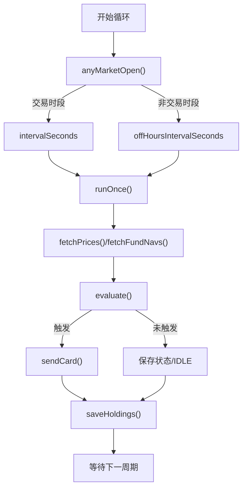
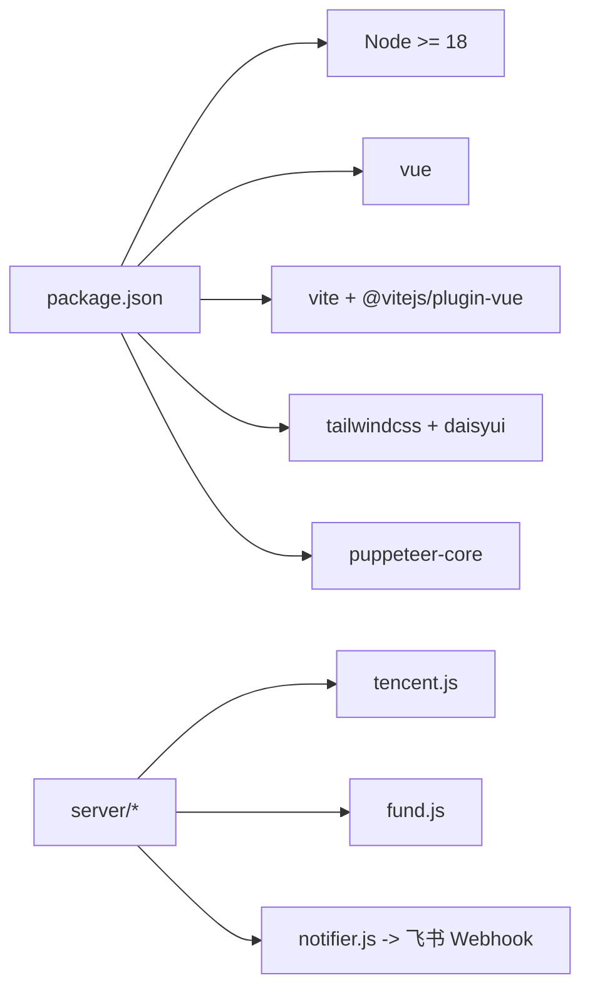

# 部署运维

<cite>
**本文引用的文件**
- [package.json](file://package.json)
- [config.json](file://config.json)
- [start.sh](file://start.sh)
- [server/index.js](file://server/index.js)
- [server/server.js](file://server/server.js)
- [server/config.js](file://server/config.js)
- [server/scheduler.js](file://server/scheduler.js)
- [server/store.js](file://server/store.js)
- [server/notifier.js](file://server/notifier.js)
- [server/strategy.js](file://server/strategy.js)
- [server/provider/tencent.js](file://server/provider/tencent.js)
- [server/provider/fund.js](file://server/provider/fund.js)
- [vite.config.js](file://vite.config.js)
- [tailwind.config.js](file://tailwind.config.js)
- [data/holdings.json](file://data/holdings.json)
</cite>

## 目录
1. [简介](#简介)
2. [项目结构](#项目结构)
3. [核心组件](#核心组件)
4. [架构总览](#架构总览)
5. [详细组件分析](#详细组件分析)
6. [依赖关系分析](#依赖关系分析)
7. [性能考虑](#性能考虑)
8. [故障排查指南](#故障排查指南)
9. [结论](#结论)
10. [附录](#附录)

## 简介
本指南面向生产环境，提供 Stock Advisor（股票秘书）的完整部署与运维说明。内容涵盖服务器要求、依赖安装、环境配置、服务启动、进程管理（含 PM2 建议）、日志轮转与自动重启、监控告警、备份恢复、安全加固、性能优化、容器化与云服务部署，以及日常运维任务（日志分析、性能调优、故障排查）。

## 项目结构
- 后端入口：server/index.js 加载配置并启动 HTTP 服务与行情调度器。
- 静态资源托管：server/server.js 提供 /api 接口并托管 Vite 构建产物 dist/。
- 数据持久化：server/store.js 读写 data/holdings.json，带内存缓存与串行写盘。
- 行情与策略：scheduler.js 定时拉取行情（腾讯/东方财富），strategy.js 计算买卖信号，notifier.js 推送飞书卡片。
- 前端：web/ 源码由 Vite 构建到 dist/，开发时通过 vite.config.js 代理 /api 到后端。
- 配置：config.json 控制调度间隔、服务端口、飞书机器人等；package.json 定义脚本与运行环境要求。

**图表来源**
- [server/index.js:1-17](file://server/index.js#L1-L17)
- [server/server.js:1-594](file://server/server.js#L1-L594)
- [server/scheduler.js:1-178](file://server/scheduler.js#L1-L178)
- [server/provider/tencent.js:1-42](file://server/provider/tencent.js#L1-L42)
- [server/provider/fund.js:1-55](file://server/provider/fund.js#L1-L55)
- [server/strategy.js:1-91](file://server/strategy.js#L1-L91)
- [server/notifier.js:1-112](file://server/notifier.js#L1-L112)
- [server/store.js:1-71](file://server/store.js#L1-L71)

**章节来源**
- [package.json:1-32](file://package.json#L1-L32)
- [vite.config.js:1-26](file://vite.config.js#L1-L26)
- [tailwind.config.js:1-54](file://tailwind.config.js#L1-L54)

## 核心组件
- 服务启动与路由：server/index.js 负责加载配置、启动 HTTP 服务与调度器；server/server.js 实现 /api 路由与静态资源托管。
- 数据存储：server/store.js 维护内存缓存与串行写入，避免并发冲突，并在首次加载时进行数据结构迁移。
- 行情与通知：scheduler.js 按交易时段动态调整刷新频率，调用 provider 获取行情，strategy.js 评估触发条件，notifier.js 发送飞书卡片。
- 前端构建：vite.config.js 将 web/ 构建至 ../dist，开发模式通过代理转发 /api 请求。

**章节来源**
- [server/index.js:1-17](file://server/index.js#L1-L17)
- [server/server.js:1-594](file://server/server.js#L1-L594)
- [server/store.js:1-71](file://server/store.js#L1-L71)
- [server/scheduler.js:1-178](file://server/scheduler.js#L1-L178)
- [server/provider/tencent.js:1-42](file://server/provider/tencent.js#L1-L42)
- [server/provider/fund.js:1-55](file://server/provider/fund.js#L1-L55)
- [server/strategy.js:1-91](file://server/strategy.js#L1-L91)
- [server/notifier.js:1-112](file://server/notifier.js#L1-L112)
- [vite.config.js:1-26](file://vite.config.js#L1-L26)

## 架构总览
系统采用单进程 Node 应用，内置 HTTP 服务同时承载前端静态页面与 REST API。后台调度器周期性执行行情抓取、策略评估与消息推送。数据以 JSON 文件形式落盘，配合内存缓存提升读取性能。

**图表来源**
- [server/server.js:567-594](file://server/server.js#L567-L594)
- [server/store.js:40-71](file://server/store.js#L40-L71)
- [server/scheduler.js:65-178](file://server/scheduler.js#L65-L178)
- [server/provider/tencent.js:6-42](file://server/provider/tencent.js#L6-L42)
- [server/provider/fund.js:6-55](file://server/provider/fund.js#L6-L55)
- [server/strategy.js:34-91](file://server/strategy.js#L34-L91)
- [server/notifier.js:81-112](file://server/notifier.js#L81-L112)

## 详细组件分析

### 服务启动与 HTTP 路由
- 启动流程：server/index.js 加载配置后启动 server/server.js 提供的 HTTP 服务，并根据环境变量 ONCE 决定是否单次执行调度。
- 路由处理：server/server.js 对 /api/* 进行解析，包含持仓列表、导入 CSV、新建/更新持仓、买入/卖出记录操作、测试飞书推送等；非 /api 路径返回静态资源。
- 错误处理：统一捕获异常并返回 JSON 错误信息；未发送头时回退为 500。

**图表来源**
- [server/server.js:35-58](file://server/server.js#L35-L58)
- [server/server.js:409-565](file://server/server.js#L409-L565)
- [server/server.js:567-594](file://server/server.js#L567-L594)

**章节来源**
- [server/index.js:1-17](file://server/index.js#L1-L17)
- [server/server.js:1-594](file://server/server.js#L1-L594)

### 数据存储与并发控制
- 内存缓存：loadHoldings 仅在首次或文件 mtime 变化时重新读盘，减少磁盘 IO。
- 串行写入：saveHoldings 使用 Promise 链串行写盘，防止调度器与接口并发写覆盖。
- 数据迁移：首次加载检测旧版扁平结构并迁移为 purchases 模型，确保一致性。

**图表来源**
- [server/store.js:1-71](file://server/store.js#L1-L71)

**章节来源**
- [server/store.js:1-71](file://server/store.js#L1-L71)

### 调度器与策略引擎
- 交易时段判断：根据 region 与时区判断当前市场是否开市，动态选择刷新间隔。
- 行情聚合：并行拉取股票与基金数据，合并为统一价格字典。
- 策略评估：基于成本加权止盈/止损与补仓条件生成触发事件。
- 冷却机制：同一触发态在冷却窗口内不重复推送，避免刷屏。

**图表来源**
- [server/scheduler.js:37-63](file://server/scheduler.js#L37-L63)
- [server/scheduler.js:65-178](file://server/scheduler.js#L65-L178)
- [server/strategy.js:34-91](file://server/strategy.js#L34-L91)

**章节来源**
- [server/scheduler.js:1-178](file://server/scheduler.js#L1-L178)
- [server/strategy.js:1-91](file://server/strategy.js#L1-L91)

### 外部数据源适配
- 股票行情：tencent.js 批量请求腾讯财经接口，解析 GBK/UTF-8 文本，提取当前价与昨收。
- 基金净值：fund.js 逐个请求东方财富 JSONP 接口，解析最新与上一交易日净值。

**章节来源**
- [server/provider/tencent.js:1-42](file://server/provider/tencent.js#L1-L42)
- [server/provider/fund.js:1-55](file://server/provider/fund.js#L1-L55)

### 通知与告警
- 飞书卡片：notifier.js 构造 interactive 卡片，支持日涨跌告警与买卖提醒。
- 签名与重试：可选 secret 签名，失败最多重试 3 次，指数退避。

**章节来源**
- [server/notifier.js:1-112](file://server/notifier.js#L1-L112)

### 前端构建与开发体验
- 构建输出：vite.config.js 将 web/ 构建到 ../dist，供后端静态托管。
- 开发代理：开发模式下 /api 请求代理到本地 :3000，便于联调。
- 主题：tailwind.config.js 配置 DaisyUI 主题与深色模式。

**章节来源**
- [vite.config.js:1-26](file://vite.config.js#L1-L26)
- [tailwind.config.js:1-54](file://tailwind.config.js#L1-L54)

## 依赖关系分析
- 运行时：Node.js >= 18（见 engines）。
- 依赖：Vue（运行时）、Vite 及插件（构建期）、Tailwind/DaisyUI（样式）、Puppeteer Core（构建期依赖）。
- 外部服务：腾讯财经、东方财富、飞书自定义机器人。

**图表来源**
- [package.json:1-32](file://package.json#L1-L32)
- [server/provider/tencent.js:1-42](file://server/provider/tencent.js#L1-L42)
- [server/provider/fund.js:1-55](file://server/provider/fund.js#L1-L55)
- [server/notifier.js:81-112](file://server/notifier.js#L81-L112)

**章节来源**
- [package.json:1-32](file://package.json#L1-L32)

## 性能考虑
- 数据读取缓存：store.js 使用内存缓存与 mtime 检测，减少频繁磁盘 IO。
- 串行写盘：saveHoldings 通过 Promise 链串行写入，避免并发写竞争。
- 网络请求批量化：tencent.js 支持批量代码查询，降低请求次数。
- 调度频率自适应：scheduler.js 在非交易时段拉长间隔，降低负载。
- 静态资源：vite.config.js 构建产物由后端直接托管，减少反向代理开销。
- 建议优化：
  - 合理设置 schedule.intervalSeconds 与 offHoursIntervalSeconds，平衡实时性与资源消耗。
  - 关注外部 API 限流与超时，必要时增加重试与熔断逻辑。
  - 定期清理历史日志与临时文件，避免磁盘增长。

[本节为通用指导，无需特定文件引用]

## 故障排查指南
- 常见问题定位：
  - 无法访问前端页面：检查 dist/ 是否存在，确认 server/server.js 静态托管路径。
  - API 报错：查看 server/server.js 的错误日志与返回码；确认 store.js 读写权限。
  - 行情缺失：检查 tencent.js/fund.js 的网络连通性与返回格式；关注控制台警告。
  - 飞书推送失败：校验 config.json 中 webhook 与 secret；查看 notifier.js 的重试日志。
- 日志位置：
  - 标准输出：Node 进程 stdout/stderr（PM2 默认日志目录）。
  - 应用日志：console.log/error 输出（如 scheduler tick、notify 错误）。
- 数据一致性：
  - 若手动修改 holdings.json，下次 loadHoldings 会检测到 mtime 变化并重新加载。
  - 注意串行写盘可能带来的短暂延迟。

**章节来源**
- [server/server.js:583-586](file://server/server.js#L583-L586)
- [server/scheduler.js:78-86](file://server/scheduler.js#L78-L86)
- [server/notifier.js:96-110](file://server/notifier.js#L96-L110)
- [server/store.js:40-69](file://server/store.js#L40-L69)

## 结论
Stock Advisor 采用简洁的单进程架构，结合内存缓存与串行写盘保障数据一致性；调度器按交易时段自适应刷新，外部数据源解耦清晰。生产部署需重点关注 Node 版本、配置文件安全、进程管理与日志轮转、监控告警与备份恢复。通过合理的性能调优与安全加固，可稳定支撑日常运营。

[本节为总结性内容，无需特定文件引用]

## 附录

### 生产环境部署流程
- 服务器要求
  - 操作系统：Linux/Windows/macOS（推荐 Linux 发行版）
  - Node.js：>= 18（见 package.json engines）
  - 磁盘：至少预留足够空间存放 dist/ 与 data/holdings.json
  - 网络：出站访问腾讯财经、东方财富、飞书 Webhook
- 依赖安装
  - 在项目根目录执行 npm install 安装依赖
  - 构建前端：npm run build（生成 dist/）
- 环境配置
  - 编辑 config.json：设置 server.host/port、schedule 间隔、feishu.webhook/secret、notify.cooldownSeconds 等
  - 如需仅执行一次行情抓取：设置环境变量 ONCE=1 并启动
- 服务启动
  - 使用 start.sh 一键启动：./start.sh（生产模式）或 ./start.sh dev（开发模式）
  - 生产模式将自动构建前端并启动后端服务（默认 http://127.0.0.1:3000）

**章节来源**
- [package.json:15-17](file://package.json#L15-L17)
- [package.json:7-14](file://package.json#L7-L14)
- [config.json:1-19](file://config.json#L1-L19)
- [start.sh:25-99](file://start.sh#L25-L99)
- [server/index.js:1-17](file://server/index.js#L1-L17)

### 进程管理方案（PM2）
- 推荐使用 PM2 管理 Node 进程，实现自动重启、日志收集与优雅停机。
- 建议配置要点（概念性说明）：
  - 启动命令：node server/index.js
  - 实例数：1（单进程应用）
  - 环境变量：NODE_ENV=production，ONCE 按需设置
  - 日志轮转：启用 PM2 日志轮转，保留最近若干天
  - 自动重启：开启崩溃自动重启，限制重启频率
  - 健康检查：可通过 /api/holdings 作为健康探针
- 注意：本项目未内置 PM2 配置文件，需在部署机自行创建 pm2 ecosystem 文件或命令行参数。

[本节为通用指导，无需特定文件引用]

### 监控与告警
- 应用性能监控
  - 指标采集：CPU/内存/事件循环延迟（可使用 PM2 生态或 APM 工具）
  - 关键指标：调度周期耗时、外部 API 成功率、错误率
- 错误日志收集
  - 集中收集 stdout/stderr 与 PM2 日志
  - 对关键错误（网络异常、飞书推送失败）设置告警规则
- 业务指标
  - 持仓数量、触发次数、冷却命中次数
  - 每日涨跌告警触发统计

[本节为通用指导，无需特定文件引用]

### 备份与恢复策略
- 数据备份
  - 定期备份 data/holdings.json（建议每小时增量、每日全量）
  - 备份前可先停止写入或确保串行写盘已完成
- 配置备份
  - 备份 config.json 与任何自定义脚本（如 start.sh、pm2 配置）
- 灾难恢复计划
  - 恢复步骤：替换 holdings.json 与 config.json，重启服务
  - 验证：访问 /api/holdings 确认数据正确；执行测试飞书推送

**章节来源**
- [server/store.js:62-69](file://server/store.js#L62-L69)
- [server/server.js:545-562](file://server/server.js#L545-L562)

### 安全加固措施
- HTTPS 配置
  - 建议使用反向代理（Nginx/Caddy）终止 TLS，并将 /api 与静态资源转发至后端
  - 强制 HTTPS、启用 HSTS、禁用不安全协议
- 访问控制
  - 限制 IP 白名单（防火墙/安全组）
  - 对敏感接口（如导入 CSV）增加鉴权（可在反向代理层实现）
- 敏感信息保护
  - 将 feishu.secret 等敏感值放入环境变量或密钥管理服务，避免明文写入仓库
  - 最小权限原则：运行账户仅具备必要文件系统权限

[本节为通用指导，无需特定文件引用]

### 性能优化建议
- 内存管理
  - 监控 Node 内存使用，必要时调整堆大小
  - 避免大对象常驻内存（当前设计已较轻量）
- 连接池配置
  - 外部 API 调用使用 fetch，可按需添加超时与重试策略
- 静态资源优化
  - 使用 CDN 缓存 dist/ 静态资源
  - 启用压缩与缓存头（在反向代理层配置）

[本节为通用指导，无需特定文件引用]

### Docker 容器化部署方案
- 基础镜像：选用 node:18-alpine 或官方 LTS 镜像
- 构建阶段：安装依赖并构建前端（npm ci && npm run build）
- 运行阶段：暴露端口（默认 3000），挂载 data/ 与 config.json 卷
- 环境变量：NODE_ENV、ONCE、FEISHU_WEBHOOK、FEISHU_SECRET 等
- 健康检查：GET /api/holdings 返回 200 视为健康
- 示例步骤（概念性说明）：编写 Dockerfile 与 docker-compose.yml，编排服务与反向代理

[本节为通用指导，无需特定文件引用]

### 云服务部署指南
- 平台选择：云服务器（ECS/EC2/CVM）或容器平台（Kubernetes/Cloud Run）
- 网络与安全组：开放 80/443（反向代理），限制入站来源
- 存储：持久化 data/ 目录，定期快照
- 监控与日志：接入云监控与日志服务，设置告警规则
- 域名与证书：绑定域名并配置自动续期证书

[本节为通用指导，无需特定文件引用]

### 日常运维任务
- 日志分析
  - 关注调度 tick、外部 API 错误、飞书推送失败
  - 定期归档与清理旧日志
- 性能调优
  - 观察 CPU/内存峰值，调整调度间隔
  - 优化外部 API 调用（超时、重试、降级）
- 故障排查
  - 网络连通性检查（DNS/防火墙）
  - 数据一致性校验（对比 holdings.json 与内存缓存）
  - 逐步隔离问题（前端/后端/外部服务）

[本节为通用指导，无需特定文件引用]