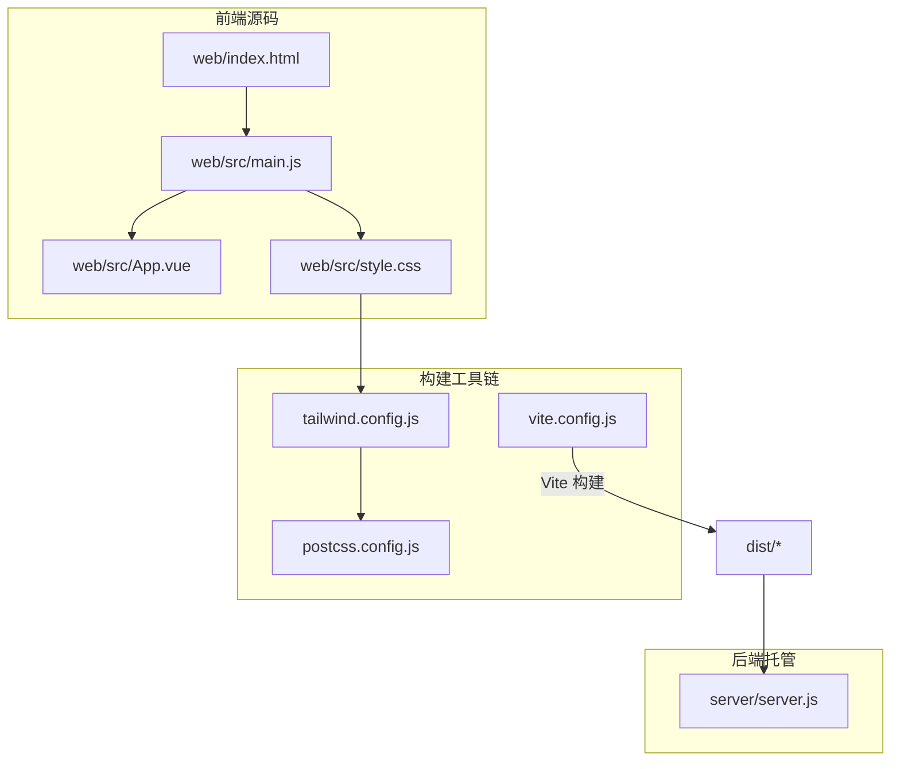
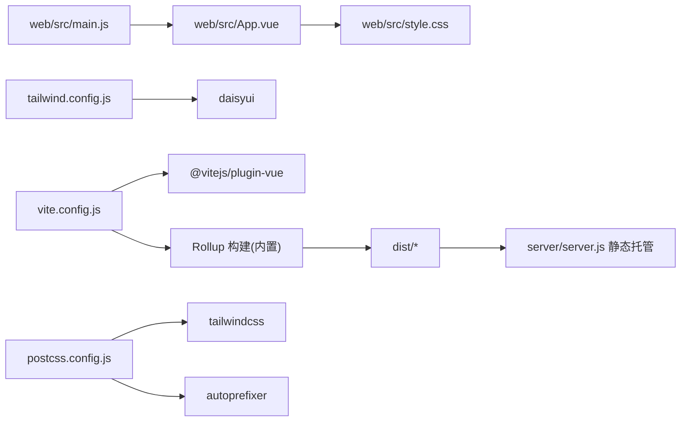

# 前端构建配置

<cite>
**本文引用的文件**
- [vite.config.js](file://vite.config.js)
- [tailwind.config.js](file://tailwind.config.js)
- [postcss.config.js](file://postcss.config.js)
- [package.json](file://package.json)
- [web/src/main.js](file://web/src/main.js)
- [web/src/style.css](file://web/src/style.css)
- [web/src/App.vue](file://web/src/App.vue)
- [server/server.js](file://server/server.js)
</cite>

## 目录
1. [简介](#简介)
2. [项目结构](#项目结构)
3. [核心组件](#核心组件)
4. [架构总览](#架构总览)
5. [详细组件分析](#详细组件分析)
6. [依赖关系分析](#依赖关系分析)
7. [性能考虑](#性能考虑)
8. [故障排查指南](#故障排查指南)
9. [结论](#结论)
10. [附录](#附录)

## 简介
本文件面向 Stock Advisor 的前端构建配置，系统性解析基于 Vite + Vue 3 的构建链路，覆盖开发服务器、模块解析、生产优化、Tailwind CSS 主题与插件、PostCSS 处理流程、开发与生产的差异、浏览器兼容性与移动端适配，以及新增 UI 组件库/样式框架的最佳实践。文档同时给出可视化架构图与流程图，帮助读者快速理解并扩展项目。

## 项目结构
前端源码位于 web/ 子目录，由 Vite 以 web 为根进行开发/构建；构建产物输出到项目根 dist/，由后端 Node 服务统一托管静态资源与 API 代理。

图表来源
- [vite.config.js:7-25](file://vite.config.js#L7-L25)
- [tailwind.config.js:4-12](file://tailwind.config.js#L4-L12)
- [postcss.config.js:1-6](file://postcss.config.js#L1-L6)
- [web/src/main.js:1-5](file://web/src/main.js#L1-L5)
- [web/src/style.css:1-3](file://web/src/style.css#L1-L3)
- [server/server.js:35-53](file://server/server.js#L35-L53)

章节来源
- [vite.config.js:7-25](file://vite.config.js#L7-L25)
- [package.json:7-14](file://package.json#L7-L14)
- [server/server.js:35-53](file://server/server.js#L35-L53)

## 核心组件
- Vite 构建入口与开发服务器：定义 root、插件、构建输出目录、开发端口与 API 代理。
- Tailwind CSS 与 DaisyUI：内容扫描路径、深色模式策略、自定义主题色板与暗色主题切换。
- PostCSS 处理器：串联 Tailwind 与自动前缀器，确保跨浏览器兼容性。
- 应用入口与样式注入：Vue 应用挂载与全局样式引入。
- 后端静态托管：将构建产物作为静态资源提供，并实现 SPA 路由回退。

章节来源
- [vite.config.js:7-25](file://vite.config.js#L7-L25)
- [tailwind.config.js:4-52](file://tailwind.config.js#L4-L52)
- [postcss.config.js:1-6](file://postcss.config.js#L1-L6)
- [web/src/main.js:1-5](file://web/src/main.js#L1-L5)
- [web/src/style.css:1-34](file://web/src/style.css#L1-L34)
- [server/server.js:35-53](file://server/server.js#L35-L53)

## 架构总览
下图展示了从源码到最终产物的完整构建与运行链路，包括开发时代理与生产时静态托管。

```mermaid
sequenceDiagram
participant Dev as "开发者浏览器"
participant Vite as "Vite 开发服务器"
participant Backend as "Node 后端(3000)"
participant Dist as "构建产物(dist)"
participant Server as "后端静态托管(server.js)"
Dev->>Vite : 访问 http : //localhost : 5173
Vite-->>Dev : 返回 index.html 与模块热更新
Dev->>Vite : 请求 /api/*
Vite->>Backend : 转发 /api/* 到 http : //127.0.0.1 : 3000
Backend-->>Vite : 返回 JSON/数据
Vite-->>Dev : 响应数据
Note over Dev,Server : 生产环境
Dev->>Server : 访问 / (或任意路由)
Server->>Dist : 读取 index.html 或对应静态文件
Dist-->>Server : 返回 HTML/CSS/JS
Server-->>Dev : 渲染页面
```

图表来源
- [vite.config.js:14-23](file://vite.config.js#L14-L23)
- [server/server.js:35-53](file://server/server.js#L35-L53)

## 详细组件分析

### Vite 构建配置（开发服务器、模块解析、生产优化）
- 根目录与插件：以 web 为根，启用 Vue 插件，支持 .vue 单文件组件。
- 构建输出：产物输出至 ../dist，构建前清空旧目录，便于部署。
- 开发服务器：
  - 绑定 host 为 true，允许局域网访问；默认端口 5173。
  - 通过 proxy 将 /api 请求转发到本地后端 3000 端口，解决跨域问题。
- 模块解析：由 Vite/Rollup 自动处理 ES 模块与依赖图；未显式配置 alias，可按需添加。
- 生产优化：使用 Vite 默认优化（基于 Rollup），包含代码压缩、Tree-shaking、资源哈希等；可通过 build 选项进一步定制。

章节来源
- [vite.config.js:7-25](file://vite.config.js#L7-L25)
- [package.json:7-14](file://package.json#L7-L14)

### Tailwind CSS 配置（主题定制、插件集成、响应式）
- 内容扫描：仅扫描 web/index.html 与 web/src 下的 .vue/.js，减少无用 CSS。
- 深色模式：采用 class 策略，配合 <html class="dark"> 切换主题。
- 主题与插件：
  - 启用 daisyui 插件，提供现成组件与主题能力。
  - 自定义两个主题 stocklight 与 stockdark，定义 primary/secondary/accent/neutral/base-* 等功能色，暗色主题在 dark 模式下自动生效。
- 响应式设计：基于 Tailwind 原子类，天然支持移动端优先的响应式布局。

章节来源
- [tailwind.config.js:4-52](file://tailwind.config.js#L4-L52)
- [web/src/style.css:1-3](file://web/src/style.css#L1-L3)

### PostCSS 处理器（自动前缀与 CSS 优化）
- 插件链：先执行 tailwindcss 生成样式，再执行 autoprefixer 添加浏览器前缀。
- 作用范围：作用于所有被 Vite 处理的 CSS/SCSS/Less 等资源。
- 兼容性：autoprefixer 依据 browserslist 目标自动决定前缀策略（本项目未显式配置 browserslist，可后续补充）。

章节来源
- [postcss.config.js:1-6](file://postcss.config.js#L1-L6)

### 应用入口与样式注入
- main.js 创建 Vue 应用实例并挂载到 #app，同时引入全局样式 style.css。
- style.css 通过 @tailwind 指令引入基础层、组件层与工具层，并设置全局高度、滚动条样式与按钮文字颜色等细节。

章节来源
- [web/src/main.js:1-5](file://web/src/main.js#L1-L5)
- [web/src/style.css:1-34](file://web/src/style.css#L1-L34)

### 后端静态托管与 SPA 路由回退
- server.js 将 dist 目录作为静态资源目录，按 URL 精确匹配文件；若不存在则回退到 index.html，保证 SPA 路由正常工作。
- 同时提供 MIME 类型映射，确保静态资源正确加载。

章节来源
- [server/server.js:22-58](file://server/server.js#L22-L58)

## 依赖关系分析
下图展示关键构建依赖与职责分工：

图表来源
- [vite.config.js:7-25](file://vite.config.js#L7-L25)
- [tailwind.config.js:4-12](file://tailwind.config.js#L4-L12)
- [postcss.config.js:1-6](file://postcss.config.js#L1-L6)
- [web/src/main.js:1-5](file://web/src/main.js#L1-L5)
- [web/src/style.css:1-3](file://web/src/style.css#L1-L3)
- [server/server.js:35-53](file://server/server.js#L35-L53)

章节来源
- [package.json:19-30](file://package.json#L19-L30)

## 性能考虑
- 代码分割与懒加载
  - 利用 Vue 异步组件与动态 import 对大组件进行按需加载，减少首屏体积。
  - 结合路由级拆分（如 vue-router）实现页面级懒加载。
- 资源优化
  - 开启 Vite 默认的生产优化（压缩、Tree-shaking、资源指纹）。
  - 图片/字体等静态资源建议使用合适格式与尺寸，必要时引入 CDN。
- 缓存策略
  - 构建产物带哈希文件名，利于浏览器长期缓存；服务端可设置 Cache-Control 头增强缓存效果。
- 网络优化
  - 开发阶段使用 Vite 的 HMR 提升体验；生产环境启用 gzip/brotli 压缩。
- 移动端适配
  - 基于 Tailwind 的响应式断点与 daisyui 组件，确保多端一致体验。
  - 注意视口与缩放设置（index.html 中 meta viewport）。

[本节为通用建议，不直接引用具体代码]

## 故障排查指南
- 开发服务器无法访问
  - 检查 vite.config.js 中的 host/port 配置，确认防火墙与端口占用。
- API 请求跨域
  - 确认 /api 代理已配置且后端服务在 3000 端口运行。
- 样式未生效
  - 确认 style.css 中 @tailwind 指令顺序正确，且 tailwind.config.js content 路径包含实际使用的模板与脚本。
- 主题切换无效
  - 确认 html 元素存在正确的 class（如 dark），并在 tailwind.config.js 中启用 class 模式的 darkMode。
- 生产构建后路由 404
  - 确认后端静态托管实现了 index.html 回退逻辑。

章节来源
- [vite.config.js:14-23](file://vite.config.js#L14-L23)
- [tailwind.config.js:6-12](file://tailwind.config.js#L6-L12)
- [web/src/style.css:1-3](file://web/src/style.css#L1-L3)
- [server/server.js:35-53](file://server/server.js#L35-L53)

## 结论
本项目采用 Vite + Vue 3 的现代前端工程化方案，结合 Tailwind CSS 与 DaisyUI 快速构建响应式界面，并通过 PostCSS 保障跨浏览器兼容性。开发阶段通过代理简化联调，生产阶段由后端统一托管静态资源并提供 SPA 路由回退。整体构建链路简洁高效，易于扩展与维护。

[本节为总结性内容，不直接引用具体代码]

## 附录

### 开发与生产构建差异
- 开发环境
  - 启动 Vite 开发服务器，启用 HMR，端口 5173，代理 /api 到后端 3000。
- 生产环境
  - 执行构建命令输出到 dist/，由后端静态托管；启用默认压缩与资源指纹。

章节来源
- [package.json:7-14](file://package.json#L7-L14)
- [vite.config.js:10-23](file://vite.config.js#L10-L23)
- [server/server.js:35-53](file://server/server.js#L35-L53)

### 浏览器兼容性与移动端适配
- 浏览器兼容
  - 通过 autoprefixer 根据 browserslist 目标自动添加前缀；可在项目根添加 browserslist 配置以精确控制兼容范围。
- 移动端适配
  - 使用 Tailwind 响应式类与 daisyui 组件，确保在不同屏幕尺寸下表现一致；注意触摸交互与字体大小。

章节来源
- [postcss.config.js:1-6](file://postcss.config.js#L1-L6)
- [tailwind.config.js:4-12](file://tailwind.config.js#L4-L12)

### 如何添加新的 UI 组件库或样式框架
- 安装依赖
  - 使用包管理器安装新库（例如 npm/yarn/pnpm install ...）。
- 引入与注册
  - 在 main.js 中按需引入组件或全局样式；或在组件内局部引入。
- 样式处理
  - 若为新 CSS 框架，确保其能被 PostCSS 处理；必要时在 postcss.config.js 中添加插件。
- 主题与配置
  - 若涉及主题定制，参考现有 tailwind.config.js 的配置方式扩展主题与插件。
- 验证
  - 运行 dev 与 build 命令，确认无报错且样式正常。

[本节为操作指南，不直接引用具体代码]