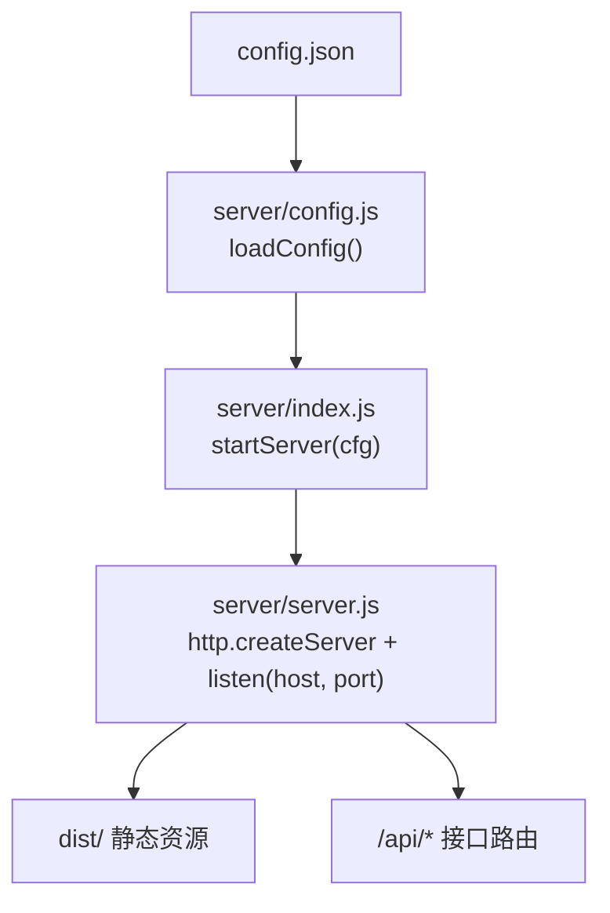
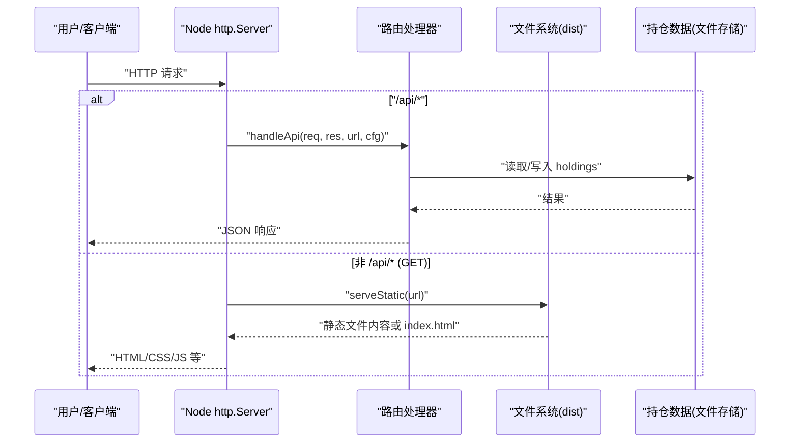
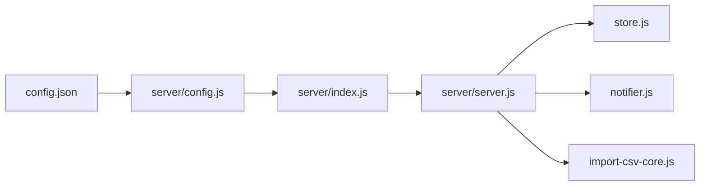

# 服务器配置

<cite>
**本文引用的文件**
- [config.json](file://config.json)
- [server/config.js](file://server/config.js)
- [server/server.js](file://server/server.js)
- [server/index.js](file://server/index.js)
- [start.sh](file://start.sh)
- [vite.config.js](file://vite.config.js)
- [package.json](file://package.json)
</cite>

## 目录
1. [简介](#简介)
2. [项目结构](#项目结构)
3. [核心组件](#核心组件)
4. [架构总览](#架构总览)
5. [详细组件分析](#详细组件分析)
6. [依赖关系分析](#依赖关系分析)
7. [性能注意事项](#性能注意事项)
8. [故障排查指南](#故障排查指南)
9. [结论](#结论)
10. [附录](#附录)

## 简介
本文聚焦 Stock Advisor 的服务器配置，深入解析 config.json 中的 server 配置段（host、port），说明监听地址与端口的含义、最佳实践、启动参数与环境变量覆盖机制，并提供本地开发、生产环境与容器化部署的配置示例与安全建议。

## 项目结构
Stock Advisor 采用 Node.js 原生 HTTP 服务托管前端静态资源并暴露 API。关键路径：
- 配置文件：config.json
- 配置加载：server/config.js
- 服务入口：server/index.js
- 服务器实现：server/server.js
- 启动脚本：start.sh
- 前端构建与代理：vite.config.js
- 包管理与脚本：package.json

图表来源
- [config.json:6-9](file://config.json#L6-L9)
- [server/config.js:7-10](file://server/config.js#L7-L10)
- [server/index.js:5-9](file://server/index.js#L5-L9)
- [server/server.js:567-592](file://server/server.js#L567-L592)

章节来源
- [config.json:1-19](file://config.json#L1-L19)
- [server/config.js:1-11](file://server/config.js#L1-L11)
- [server/index.js:1-17](file://server/index.js#L1-L17)
- [server/server.js:567-592](file://server/server.js#L567-L592)
- [start.sh:48-99](file://start.sh#L48-L99)
- [vite.config.js:14-24](file://vite.config.js#L14-L24)
- [package.json:7-14](file://package.json#L7-L14)

## 核心组件
- 配置加载器：从项目根目录读取 config.json 并返回 JSON 对象。
- 服务器启动器：根据 cfg.server.host 与 cfg.server.port 启动 Node http.Server；若未提供则使用默认值。
- 路由与静态资源：统一处理 /api/* 请求与前端静态资源托管。
- 启动脚本：封装开发与生产模式，自动构建前端并启动后端。

章节来源
- [server/config.js:7-10](file://server/config.js#L7-L10)
- [server/server.js:567-592](file://server/server.js#L567-L592)
- [server/index.js:5-9](file://server/index.js#L5-L9)
- [start.sh:79-99](file://start.sh#L79-L99)

## 架构总览
下图展示了从配置到服务监听的完整链路，以及请求在服务器内的分发流程。

图表来源
- [server/server.js:571-592](file://server/server.js#L571-L592)
- [server/server.js:36-53](file://server/server.js#L36-L53)
- [server/server.js:409-565](file://server/server.js#L409-L565)

## 详细组件分析

### 配置段 server 的含义与取值
- host：监听地址。用于控制服务对外暴露的网络接口。
  - 0.0.0.0：绑定所有可用网络接口，允许局域网或其他机器访问。适合生产环境通过反向代理或防火墙暴露服务。
  - 127.0.0.1：仅本机可访问。适合本地调试或在容器内由反向代理转发。
  - 其他具体 IP：仅在指定网卡上监听，适用于多网卡或多租户场景。
- port：监听端口。Node 服务将在此端口接收 HTTP 请求。
  - 默认行为：当 cfg.server.port 缺失时回退为 3000；cfg.server.host 缺失时回退为 127.0.0.1。
  - 常见选择：3000、8080、8000、80、443（HTTPS）。注意系统权限与端口占用。

章节来源
- [config.json:6-9](file://config.json#L6-L9)
- [server/server.js:567-570](file://server/server.js#L567-L570)

### 服务器监听地址与端口最佳实践
- 监听地址
  - 本地开发：建议使用 127.0.0.1 避免误暴露；或通过 Vite 开发服务器（host: true）在局域网访问前端，同时代理 /api 到后端。
  - 生产环境：通常使用 0.0.0.0 配合反向代理（Nginx/Traefik）或容器网络策略进行访问控制。
- 端口管理
  - 优先选择高位端口（如 3000、8080），避免与系统服务冲突。
  - 端口冲突处理：修改 port 或停止占用进程；使用 lsof/netstat 定位占用。
  - 防火墙设置：确保入站规则放行对应端口；生产环境建议仅对反向代理开放，再由代理对外暴露。
- HTTPS 与反向代理
  - 本服务为纯 HTTP。建议在反向代理层终止 TLS，并将请求转发至本服务的 127.0.0.1:3000。
- CORS 与访问控制
  - 当前代码未内置 CORS 中间件。跨域访问需通过反向代理设置响应头或在前端同域部署。
  - 访问控制：在生产环境中通过反向代理的鉴权、IP 白名单、限流等能力保护后端。

章节来源
- [server/server.js:567-592](file://server/server.js#L567-L592)
- [vite.config.js:14-24](file://vite.config.js#L14-L24)

### 启动参数与环境变量覆盖机制
- 环境变量
  - ONCE：当设置 process.env.ONCE 时，服务会执行一次行情抓取后退出，便于一次性任务。该逻辑在服务入口中判断。
  - 注意：当前代码未定义 SERVER_HOST 或 SERVER_PORT 等环境变量来覆盖 cfg.server.host/port。如需动态覆盖，可在 loadConfig 中合并环境变量后再传给 startServer。
- 启动方式
  - npm start：执行 node server/index.js，读取 config.json 并启动服务。
  - start.sh：封装开发与生产模式。生产模式先构建前端（如 dist 不存在），再调用 npm start。

章节来源
- [server/index.js:12-16](file://server/index.js#L12-L16)
- [package.json:7-14](file://package.json#L7-L14)
- [start.sh:79-99](file://start.sh#L79-L99)

### 不同部署环境的配置示例
- 本地开发
  - 目标：前端热更新 + 后端 API。
  - 做法：运行 start.sh dev，Vite 开发服务器监听 5173 并代理 /api 到 127.0.0.1:3000；后端默认监听 127.0.0.1:3000。
  - 参考：[start.sh:51-77](file://start.sh#L51-L77)、[vite.config.js:14-24](file://vite.config.js#L14-L24)
- 生产环境（单机）
  - 目标：直接对外提供服务或经反向代理。
  - 做法：确保 config.json 中 server.host 为 0.0.0.0（或仅监听 127.0.0.1 并由代理转发），port 为非占用端口；启动 start.sh 或 npm start。
  - 参考：[config.json:6-9](file://config.json#L6-L9)、[start.sh:79-99](file://start.sh#L79-L99)
- 容器化部署（Docker/K8s）
  - 目标：在容器内以最小权限暴露服务。
  - 做法：容器内监听 127.0.0.1:3000，通过 Service/Ingress 暴露；或使用 0.0.0.0:3000 并在容器网络层限制访问。
  - 参考：[server/server.js:567-592](file://server/server.js#L567-L592)

### 安全配置建议
- HTTPS
  - 在本服务前部署 Nginx/Traefik 等终止 TLS，并将请求转发到本服务的 HTTP 端口。
- CORS
  - 若前后端分离且跨域，建议在反向代理层设置 Access-Control-Allow-* 头，或在服务端增加 CORS 中间件（当前未内置）。
- 访问控制
  - 使用反向代理实现鉴权、IP 白名单、速率限制。
  - 生产环境不建议将 3000 端口直接暴露给公网。
- 日志与监控
  - 记录错误日志与访问日志，结合集中式日志平台进行告警。

章节来源
- [server/server.js:571-592](file://server/server.js#L571-L592)

## 依赖关系分析
- 配置加载依赖 fs/promises 读取 config.json。
- 服务启动依赖 Node http 模块创建服务器并监听 host:port。
- 路由处理依赖 store、notifier、import-csv-core 等模块完成业务逻辑。
- 启动脚本依赖 npm scripts 与 vite 构建产物。

图表来源
- [server/config.js:7-10](file://server/config.js#L7-L10)
- [server/index.js:1-9](file://server/index.js#L1-L9)
- [server/server.js:1-8](file://server/server.js#L1-L8)

章节来源
- [server/config.js:1-11](file://server/config.js#L1-L11)
- [server/index.js:1-17](file://server/index.js#L1-L17)
- [server/server.js:1-8](file://server/server.js#L1-L8)

## 性能注意事项
- 端口复用与高并发：Node 单线程事件循环，合理设置连接数与超时；在高并发场景下考虑水平扩展多个实例并通过负载均衡接入。
- 静态资源：生产环境应使用构建后的 dist 静态资源，减少运行时 IO。
- 调度频率：schedule.intervalSeconds 与 offHoursIntervalSeconds 影响外部数据拉取频率，请根据数据源限制调整。

## 故障排查指南
- 端口被占用
  - 现象：启动时报错端口占用。
  - 处理：修改 config.json 中的 port，或释放占用进程。
- 无法从局域网访问
  - 现象：本机可访问，局域网不可访问。
  - 处理：确认 host 是否为 0.0.0.0；检查防火墙与路由器端口映射。
- 跨域问题
  - 现象：浏览器控制台报 CORS 错误。
  - 处理：通过反向代理设置 CORS 头，或将前后端部署在同域。
- 环境变量未生效
  - 现象：期望通过环境变量覆盖 host/port 但未生效。
  - 处理：当前代码未支持 SERVER_HOST/SERVER_PORT 覆盖；如需此能力，请在 loadConfig 中合并环境变量。

章节来源
- [server/server.js:567-592](file://server/server.js#L567-L592)
- [server/config.js:7-10](file://server/config.js#L7-L10)
- [server/index.js:12-16](file://server/index.js#L12-L16)

## 结论
Stock Advisor 的服务器配置简洁清晰：通过 config.json 的 server 段控制 host 与 port，默认值保证本地开箱即用。生产环境建议结合反向代理实现 HTTPS、CORS 与访问控制，并通过防火墙与容器网络策略保障安全。对于需要动态覆盖的场景，可在配置加载阶段引入环境变量合并机制。

## 附录
- 常用命令
  - 启动生产服务：npm start 或 ./start.sh
  - 启动开发模式：./start.sh dev
- 相关配置位置
  - 服务器监听：server/server.js 的 startServer
  - 配置读取：server/config.js 的 loadConfig
  - 启动脚本：start.sh
  - 前端代理：vite.config.js