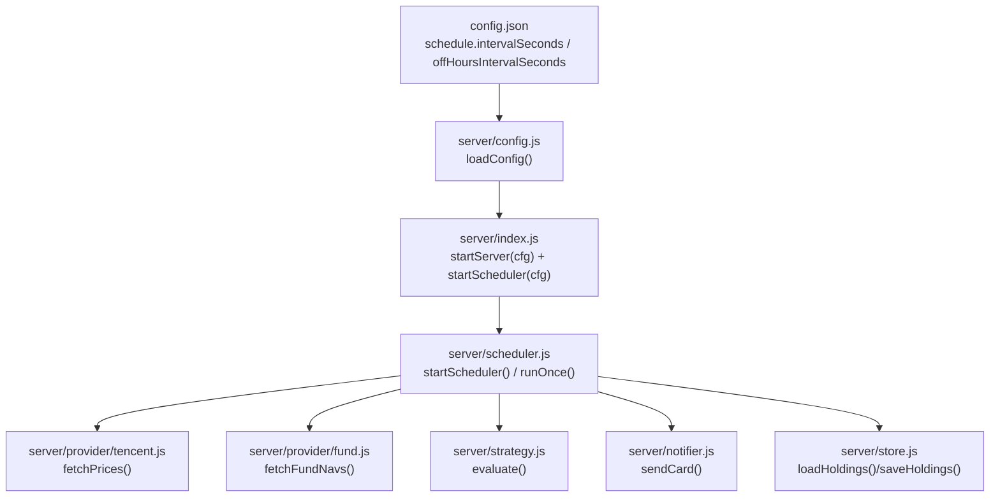
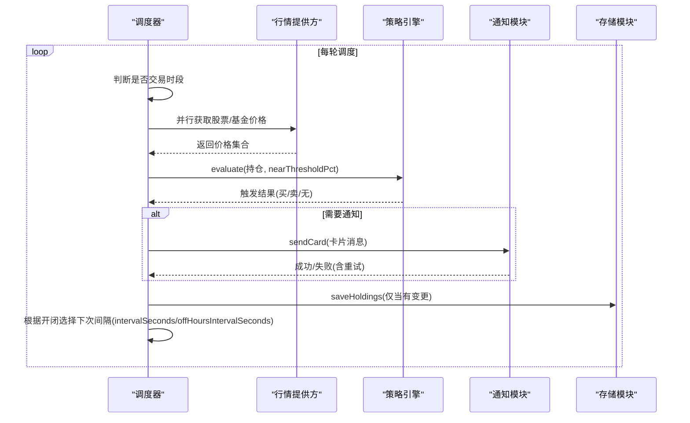
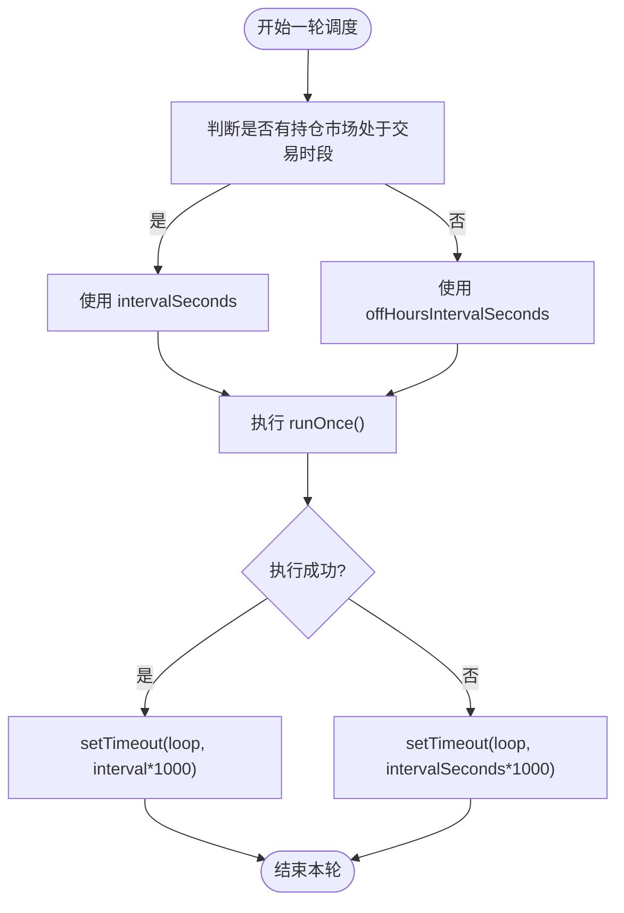
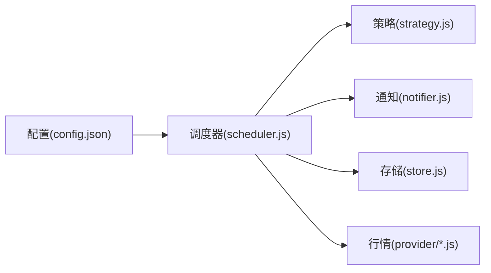

# 调度器配置

<cite>
**本文引用的文件**
- [config.json](file://config.json)
- [server/scheduler.js](file://server/scheduler.js)
- [server/config.js](file://server/config.js)
- [server/index.js](file://server/index.js)
- [server/notifier.js](file://server/notifier.js)
- [server/strategy.js](file://server/strategy.js)
- [server/store.js](file://server/store.js)
- [package.json](file://package.json)
</cite>

## 目录
1. [简介](#简介)
2. [项目结构](#项目结构)
3. [核心组件](#核心组件)
4. [架构总览](#架构总览)
5. [详细组件分析](#详细组件分析)
6. [依赖关系分析](#依赖关系分析)
7. [性能与资源优化](#性能与资源优化)
8. [故障恢复与监控告警](#故障恢复与监控告警)
9. [结论](#结论)
10. [附录：市场交易时段与配置建议](#附录市场交易时段与配置建议)

## 简介
本文件聚焦 Stock Advisor 的调度器配置，围绕 schedule 配置段中的 intervalSeconds 与 offHoursIntervalSeconds 参数进行深度解析，说明交易时段与非交易时段的轮询策略、时间管理机制（定时器精度、任务调度、资源优化）、不同市场（A股、港股、美股）的交易时段差异，并提供性能优化与故障恢复实践建议。

## 项目结构
调度器相关代码集中在 server 目录下，配置文件位于根目录 config.json。启动入口在 server/index.js，负责加载配置并启动 Web 服务与调度循环。

图表来源
- [config.json:1-19](file://config.json#L1-L19)
- [server/config.js:7-10](file://server/config.js#L7-L10)
- [server/index.js:1-17](file://server/index.js#L1-L17)
- [server/scheduler.js:58-178](file://server/scheduler.js#L58-L178)
- [server/notifier.js:80-112](file://server/notifier.js#L80-L112)
- [server/strategy.js:34-91](file://server/strategy.js#L34-L91)
- [server/store.js:40-71](file://server/store.js#L40-L71)

章节来源
- [config.json:1-19](file://config.json#L1-L19)
- [server/config.js:7-10](file://server/config.js#L7-L10)
- [server/index.js:1-17](file://server/index.js#L1-L17)

## 核心组件
- 配置加载：从 config.json 读取 schedule 段，包含 intervalSeconds（交易时段轮询间隔）与 offHoursIntervalSeconds（非交易时段轮询间隔）。
- 调度器：根据当前是否处于持仓品种的市场交易时段，动态选择轮询间隔；每次执行一次完整流程：拉取行情、计算策略、发送通知、持久化状态。
- 策略引擎：基于成本加权止盈、单笔止损、补仓条件触发提醒。
- 通知模块：飞书机器人卡片消息，支持签名与重试。
- 存储模块：内存缓存 + 串行写盘，避免并发冲突。

章节来源
- [server/scheduler.js:58-178](file://server/scheduler.js#L58-L178)
- [server/strategy.js:34-91](file://server/strategy.js#L34-L91)
- [server/notifier.js:80-112](file://server/notifier.js#L80-L112)
- [server/store.js:40-71](file://server/store.js#L40-L71)

## 架构总览
调度器以“定时循环”的方式运行，依据市场开闭切换轮询频率，降低非交易时段的资源消耗；每次 tick 并行拉取股票与基金数据，统一评估后按需推送通知，并持久化变更。

图表来源
- [server/scheduler.js:65-178](file://server/scheduler.js#L65-L178)
- [server/notifier.js:80-112](file://server/notifier.js#L80-L112)
- [server/store.js:40-71](file://server/store.js#L40-L71)

## 详细组件分析

### 调度器与时间管理
- 交易时段判定：按持仓品种所在市场时区，判断当前是否为周末及是否在交易所开盘区间（A股沪/深、港股、美股）。
- 动态间隔选择：若任一持仓市场处于交易时段，使用 intervalSeconds；否则使用 offHoursIntervalSeconds（默认 300 秒）。
- 定时器实现：使用 setTimeout 递归调用，形成“执行完再等待下一轮”的模式，避免重叠执行；异常情况下回退到交易时段间隔，保证系统自愈。
- 精度与开销：Node.js 的 setTimeout 精度受事件循环影响，通常存在数毫秒到数十毫秒抖动；对于分钟级轮询场景足够。通过非交易时段降频显著降低 CPU 与网络请求。

图表来源
- [server/scheduler.js:37-63](file://server/scheduler.js#L37-L63)
- [server/scheduler.js:167-178](file://server/scheduler.js#L167-L178)

章节来源
- [server/scheduler.js:37-63](file://server/scheduler.js#L37-L63)
- [server/scheduler.js:167-178](file://server/scheduler.js#L167-L178)

### 交易时段与非交易时段轮询策略
- 交易时段：intervalSeconds 控制高频刷新，适合盘中实时跟踪与及时提醒。
- 非交易时段：offHoursIntervalSeconds 控制低频刷新，减少 API 调用与服务器负载，适用于盘后复盘或隔夜监控。
- 策略建议：
  - 交易时段：建议 15–30 秒，兼顾时效性与限流风险。
  - 非交易时段：建议 120–600 秒，降低资源占用。
  - 若持仓跨多市场，可结合各市场时差设置更细粒度的间隔（例如美股收盘后仍对亚洲市场保持较高频率）。

章节来源
- [config.json:1-19](file://config.json#L1-L19)
- [server/scheduler.js:58-63](file://server/scheduler.js#L58-L63)

### 不同市场的交易时段配置差异
- A股（上海/深圳）：本地时区 Asia/Shanghai，上午 9:30–11:30，下午 13:00–15:00。
- 港股：本地时区 Asia/Hong_Kong，上午 9:30–12:00，下午 13:00–16:00。
- 美股：本地时区 America/New_York，全天 9:30–16:00。
- 注意：上述为简化规则，未包含法定节假日与临时休市；实际部署需考虑节假日与夏令时。

章节来源
- [server/scheduler.js:7-47](file://server/scheduler.js#L7-L47)

### 任务调度与资源优化
- 并行拉取：股票与基金价格通过 Promise.all 并行获取，缩短单次 tick 耗时。
- 冷却机制：同一触发态在 cooldownSeconds 内不重复通知，避免刷屏与过度通知。
- 串行写盘：保存持仓采用队列串行写入，防止并发覆盖。
- 内存缓存：首次加载或文件被外部修改时重新读盘，其余复用内存，减少 IO。

章节来源
- [server/scheduler.js:77-87](file://server/scheduler.js#L77-L87)
- [server/scheduler.js:135-141](file://server/scheduler.js#L135-L141)
- [server/store.js:40-71](file://server/store.js#L40-L71)

### 错误处理与容错
- 行情拉取失败：单个 provider 异常不影响整体流程，记录日志并继续处理其他标的。
- 通知失败：内置最多 3 次重试，指数退避式等待，最终抛错由上层捕获。
- 调度异常：runOnce 抛出异常时，调度器回退到交易时段间隔继续循环，保障长期稳定运行。

章节来源
- [server/scheduler.js:77-86](file://server/scheduler.js#L77-L86)
- [server/scheduler.js:167-178](file://server/scheduler.js#L167-L178)
- [server/notifier.js:96-110](file://server/notifier.js#L96-L110)

## 依赖关系分析
调度器依赖多个子系统协同工作，耦合点清晰：
- 配置层：loadConfig 提供 schedule、notify、feishu 等配置。
- 数据层：store 提供持仓数据的读写与缓存。
- 策略层：strategy 基于持仓与价格计算触发信号。
- 通知层：notifier 将信号转换为飞书卡片并发送。
- 外部依赖：provider 提供行情数据（腾讯股票、东方财富基金净值）。

图表来源
- [server/scheduler.js:1-6](file://server/scheduler.js#L1-L6)
- [server/config.js:7-10](file://server/config.js#L7-L10)
- [server/notifier.js:80-112](file://server/notifier.js#L80-L112)
- [server/strategy.js:34-91](file://server/strategy.js#L34-L91)
- [server/store.js:40-71](file://server/store.js#L40-L71)

章节来源
- [server/scheduler.js:1-6](file://server/scheduler.js#L1-L6)
- [server/config.js:7-10](file://server/config.js#L7-L10)

## 性能与资源优化
- 合理设置轮询间隔：
  - 交易时段：15–30 秒，平衡实时性与限流风险。
  - 非交易时段：120–600 秒，降低无效请求。
- 避免 API 限流：
  - 合并请求：已使用 Promise.all 并行拉取，避免串行阻塞。
  - 冷却通知：cooldownSeconds 避免短时间内重复通知。
  - 关注 provider 侧速率限制，必要时增加随机抖动或退避。
- 资源消耗控制：
  - 仅在持仓状态变化时写盘，减少磁盘 IO。
  - 内存缓存减少重复 IO。
  - 非交易时段降频显著降低 CPU 与网络占用。
- 监控与观测：
  - 观察日志中 [tick] 输出，统计每次 tick 耗时与触发次数。
  - 对 notifier 失败率与重试次数进行统计，便于发现第三方服务异常。

[本节为通用指导，无需特定文件引用]

## 故障恢复与监控告警
- 任务重试：
  - 通知发送内置 3 次重试，逐步退避，提高成功率。
- 错误处理：
  - 行情拉取异常不影响主流程，记录错误并跳过该标的。
  - 调度异常时回退到交易时段间隔继续循环，确保系统自恢复。
- 监控告警：
  - 可通过日志关键字（如 [stock-fetch]、[fund-fetch]、[notify-daily]、[notify]、[store]）接入日志平台。
  - 建议在通知失败达到阈值时触发运维告警。
- 数据一致性：
  - 串行写盘与内存缓存避免并发写冲突。
  - 文件 mtime 检测避免重复重载，提升稳定性。

章节来源
- [server/notifier.js:96-110](file://server/notifier.js#L96-L110)
- [server/scheduler.js:77-86](file://server/scheduler.js#L77-L86)
- [server/scheduler.js:167-178](file://server/scheduler.js#L167-L178)
- [server/store.js:40-71](file://server/store.js#L40-L71)

## 结论
Stock Advisor 的调度器通过“交易时段高频、非交易时段低频”的策略，在保证盘中实时性的同时有效降低资源消耗。其时间管理简单可靠，配合并行拉取、冷却通知与串行写盘，具备较好的鲁棒性。针对不同市场交易时段差异，可按需调整轮询间隔与通知策略，并结合日志与告警完善运维闭环。

[本节为总结性内容，无需特定文件引用]

## 附录：市场交易时段与配置建议
- A股（上海/深圳）：Asia/Shanghai，上午 9:30–11:30，下午 13:00–15:00。
- 港股：Asia/Hong_Kong，上午 9:30–12:00，下午 13:00–16:00。
- 美股：America/New_York，9:30–16:00。
- 配置建议：
  - 若主要持有 A 股：交易时段 20 秒左右，非交易时段 300 秒。
  - 若持有港股/美股：可根据对应市场开盘时间微调，例如美股盘前/盘后也可单独设定更低频。
  - 跨市场组合：可在非交易时段进一步拉长间隔，或在某市场开盘前适当提前提高频率。

章节来源
- [server/scheduler.js:7-47](file://server/scheduler.js#L7-L47)
- [config.json:1-19](file://config.json#L1-L19)