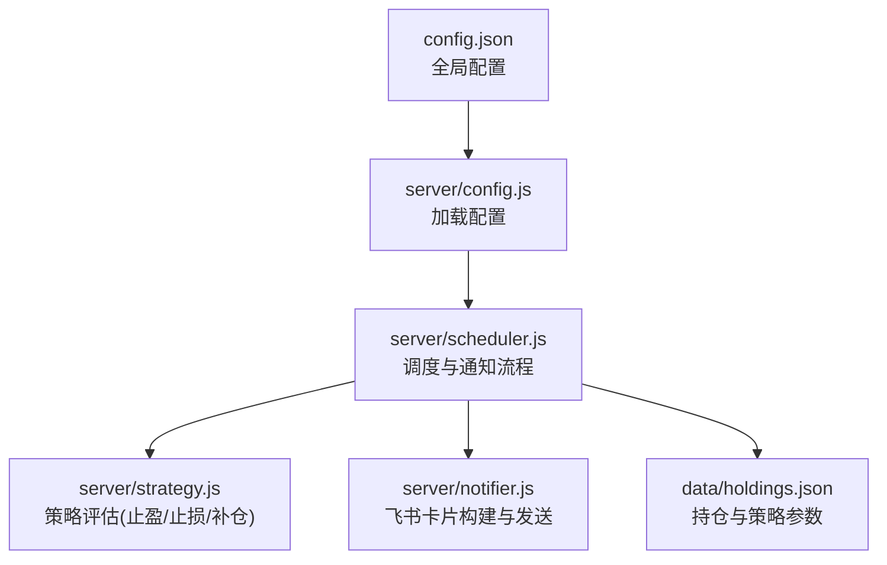
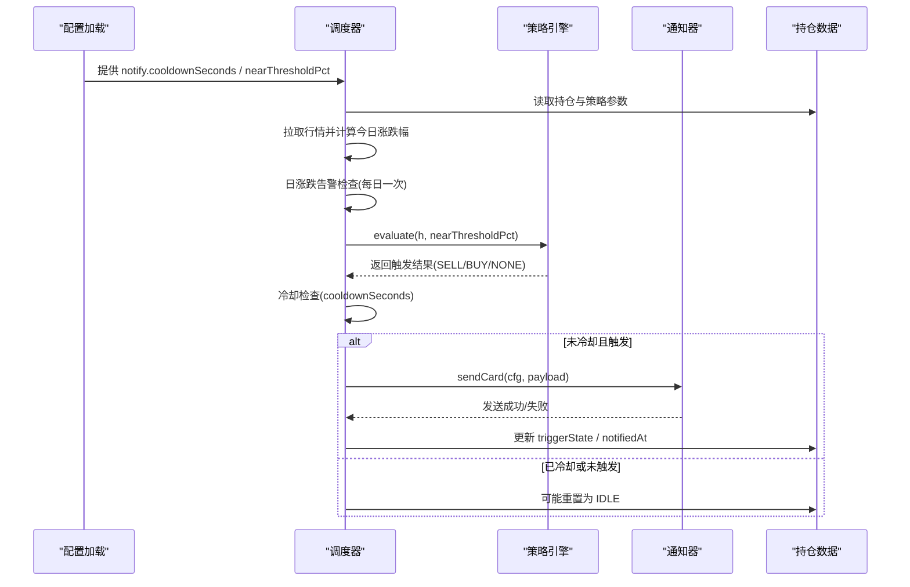
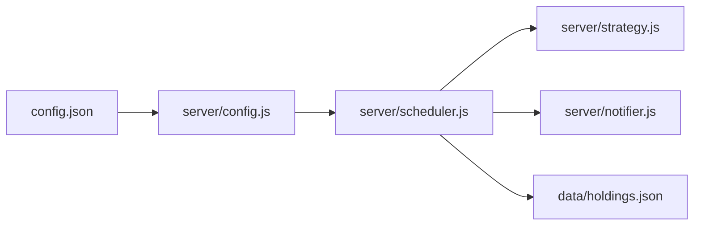

# 通知阈值配置

<cite>
**本文引用的文件**
- [config.json](file://config.json)
- [server/config.js](file://server/config.js)
- [server/scheduler.js](file://server/scheduler.js)
- [server/strategy.js](file://server/strategy.js)
- [server/notifier.js](file://server/notifier.js)
- [data/holdings.json](file://data/holdings.json)
</cite>

## 目录
1. [简介](#简介)
2. [项目结构](#项目结构)
3. [核心组件](#核心组件)
4. [架构总览](#架构总览)
5. [详细组件分析](#详细组件分析)
6. [依赖关系分析](#依赖关系分析)
7. [性能考量](#性能考量)
8. [故障排查指南](#故障排查指南)
9. [结论](#结论)
10. [附录](#附录)

## 简介
本文档围绕 Stock Advisor 的通知阈值配置进行系统化说明，重点解析 notify 配置段（cooldownSeconds、nearThresholdPct）的作用与设置方法，阐述止盈止损阈值的计算策略（百分比与绝对值），解释通知冷却机制以避免频繁通知，并覆盖不同策略类型（日涨跌告警、补仓计划等）的阈值设置。同时提供基于历史数据与风险评估的阈值优化建议、动态调整方法与监控指标，以及配置对系统性能的影响和优化建议。

## 项目结构
Stock Advisor 的通知能力由“调度器 + 策略引擎 + 通知器”三部分协作完成：
- 配置文件：定义全局通知参数（如冷却时间、接近阈值百分比）。
- 调度器：定时拉取行情，评估触发条件，执行通知与状态更新。
- 策略引擎：根据持仓买入记录计算加权止盈/止损与补仓条件，结合 nearThresholdPct 判断“接近阈值”。
- 通知器：构造飞书卡片消息并发送，支持签名与重试。

图表来源
- [config.json:1-18](file://config.json#L1-L18)
- [server/config.js:7-10](file://server/config.js#L7-L10)
- [server/scheduler.js:65-165](file://server/scheduler.js#L65-L165)
- [server/strategy.js:34-90](file://server/strategy.js#L34-L90)
- [server/notifier.js:4-111](file://server/notifier.js#L4-L111)
- [data/holdings.json:1-462](file://data/holdings.json#L1-L462)

章节来源
- [config.json:1-18](file://config.json#L1-L18)
- [server/config.js:7-10](file://server/config.js#L7-L10)
- [server/scheduler.js:65-165](file://server/scheduler.js#L65-L165)
- [server/strategy.js:34-90](file://server/strategy.js#L34-L90)
- [server/notifier.js:4-111](file://server/notifier.js#L4-L111)
- [data/holdings.json:1-462](file://data/holdings.json#L1-L462)

## 核心组件
- 配置加载：从根目录 config.json 读取全局配置，包含 schedule、server、feishu、notify 等段落。
- 调度循环：按交易时段选择刷新间隔，拉取行情，执行日涨跌告警与策略评估，应用冷却逻辑后发送通知，持久化状态。
- 策略评估：基于多次买入记录的加权平均成本计算收益率，结合近阈值百分比判断是否接近或达到止盈/止损；同时依据最近买入价与补仓参数判断买点。
- 通知发送：构造飞书 interactive 卡片，支持 secret 签名与失败重试。

章节来源
- [server/config.js:7-10](file://server/config.js#L7-L10)
- [server/scheduler.js:65-165](file://server/scheduler.js#L65-L165)
- [server/strategy.js:34-90](file://server/strategy.js#L34-L90)
- [server/notifier.js:80-111](file://server/notifier.js#L80-L111)

## 架构总览
下图展示了通知阈值配置在系统中的流转路径：配置加载 → 调度评估 → 策略计算 → 冷却控制 → 通知发送。

图表来源
- [server/config.js:7-10](file://server/config.js#L7-L10)
- [server/scheduler.js:65-165](file://server/scheduler.js#L65-L165)
- [server/strategy.js:34-90](file://server/strategy.js#L34-L90)
- [server/notifier.js:80-111](file://server/notifier.js#L80-L111)
- [data/holdings.json:1-462](file://data/holdings.json#L1-L462)

## 详细组件分析

### 通知配置段 notify
- cooldownSeconds：同一触发态在冷却窗口内不重复通知，避免刷屏。默认值为 3600 秒（1小时）。
- nearThresholdPct：用于“接近阈值”的判断缓冲带，例如当收益接近目标时提前提醒。默认值为 2%。

这些参数在调度器中参与冷却判定与策略评估，直接影响通知频率与提醒时机。

章节来源
- [config.json:14-17](file://config.json#L14-L17)
- [server/scheduler.js:126-141](file://server/scheduler.js#L126-L141)
- [server/strategy.js:34-90](file://server/strategy.js#L34-L90)

### 止盈止损阈值策略（百分比与绝对值）
- 加权止盈：系统按每次买入的成本权重计算加权目标收益率，当当前收益率达到或接近该目标（考虑 nearThresholdPct）时，触发卖出提醒。
- 单笔止损：对每笔买入单独计算跌幅，若触及该笔设置的止损比例（同样考虑 nearThresholdPct），则触发止损提醒。
- 补仓买点：当价格低于补仓价或较最近买入价跌幅达到补仓降幅阈值（考虑 nearThresholdPct）时，触发补仓提醒。

注意：
- 百分比计算基于买入记录中的 targetProfitRate 与 stopLossRate。
- 绝对值补仓通过 refillPrice 字段实现；相对跌幅补仓通过 refillDropRate 字段实现。

章节来源
- [server/strategy.js:5-32](file://server/strategy.js#L5-L32)
- [server/strategy.js:41-87](file://server/strategy.js#L41-L87)
- [data/holdings.json:14-174](file://data/holdings.json#L14-L174)
- [data/holdings.json:188-252](file://data/holdings.json#L188-L252)

### 日涨跌告警
- 每个持仓可设置 dailyRiseAlertPct 与 dailyDropAlertPct，分别表示当日涨幅/跌幅超过阈值即告警。
- 每日仅发送一次，通过 dailyAlertSentDate 字段去重。
- 适用于高波动品种（如杠杆ETF）的风险提示。

章节来源
- [server/scheduler.js:101-124](file://server/scheduler.js#L101-L124)
- [data/holdings.json:324-338](file://data/holdings.json#L324-L338)

### 通知冷却机制
- 冷却条件：同一触发态（如 SELL 或 BUY）且在 notifiedAt 之后未超过 cooldownSeconds。
- 作用：防止同一事件在短时间内反复通知，降低打扰与外部服务压力。
- 状态管理：触发后更新 triggerState 与 notifiedAt；若无触发则重置为 IDLE。

章节来源
- [server/scheduler.js:126-157](file://server/scheduler.js#L126-L157)

### 通知消息与渠道
- 消息类型：飞书 interactive 卡片，区分日涨跌告警与买卖点提醒。
- 安全：支持 secret 签名，确保 webhook 调用安全。
- 可靠性：最多三次重试，指数退避式等待。

章节来源
- [server/notifier.js:4-78](file://server/notifier.js#L4-L78)
- [server/notifier.js:80-111](file://server/notifier.js#L80-L111)

### 不同策略类型的阈值设置
- 基金/股票通用：通过 purchases 中的 targetProfitRate 与 stopLossRate 设置百分比止盈止损；refillPrice/refillDropRate 设置补仓策略。
- 高波动品种：可启用 dailyRiseAlertPct/dailyDropAlertPct 进行日内风险告警。
- 示例参考：某港股高波动品种设置了较高的日内涨跌阈值以适配其波动特性。

章节来源
- [data/holdings.json:14-174](file://data/holdings.json#L14-L174)
- [data/holdings.json:188-252](file://data/holdings.json#L188-L252)
- [data/holdings.json:324-338](file://data/holdings.json#L324-L338)

### 阈值优化的最佳实践
- 基于历史数据：统计各品种的历史波动率与最大回撤，据此设定合理的 dailyRiseAlertPct/dailyDropAlertPct 与 refillDropRate。
- 风险控制：将 stopLossRate 设置为能限制单笔亏损的比例，并结合 nearThresholdPct 提前预警。
- 分批止盈：对多笔买入采用加权目标收益率，避免单一阈值导致过早或过晚退出。
- 冷却时间：根据市场活跃度与个人接收习惯调整 cooldownSeconds，平衡及时性与打扰度。

[本节为概念性指导，不直接分析具体代码文件]

### 阈值动态调整与监控指标
- 动态调整：
  - 根据近期波动率变化调大/缩小 dailyRiseAlertPct/dailyDropAlertPct。
  - 根据趋势与支撑位调整 refillPrice/refillDropRate。
  - 根据通知效果与误报率调整 cooldownSeconds 与 nearThresholdPct。
- 监控指标：
  - 触发次数与冷却命中次数（来自 scheduler 日志）。
  - 通知发送成功率与失败重试次数（来自 notifier 日志）。
  - 持仓状态切换频率（triggerState 变更）。
  - 日涨跌告警触发频次（dailyAlertSentDate 更新频率）。

章节来源
- [server/scheduler.js:161-165](file://server/scheduler.js#L161-L165)
- [server/notifier.js:96-111](file://server/notifier.js#L96-L111)

### 阈值配置对系统性能的影响与建议
- 影响点：
  - nearThresholdPct 过小会导致频繁触发，增加通知与存储写入。
  - cooldownSeconds 过短会提升通知频率，增加网络请求与外部服务压力。
  - 高频 tick 与过多持仓会增加行情拉取与评估开销。
- 优化建议：
  - 合理设置 nearThresholdPct（如 1%-3%）以减少抖动。
  - 根据交易时段与非交易时段使用不同刷新间隔（已在调度器中实现）。
  - 针对高波动品种单独配置更高的日内告警阈值，减少误报。
  - 关注通知失败重试对性能的影响，必要时调整重试策略或限流。

章节来源
- [server/scheduler.js:58-63](file://server/scheduler.js#L58-L63)
- [server/scheduler.js:126-157](file://server/scheduler.js#L126-L157)
- [server/notifier.js:96-111](file://server/notifier.js#L96-L111)

## 依赖关系分析

图表来源
- [config.json:1-18](file://config.json#L1-L18)
- [server/config.js:7-10](file://server/config.js#L7-L10)
- [server/scheduler.js:65-165](file://server/scheduler.js#L65-L165)
- [server/strategy.js:34-90](file://server/strategy.js#L34-L90)
- [server/notifier.js:4-111](file://server/notifier.js#L4-L111)
- [data/holdings.json:1-462](file://data/holdings.json#L1-L462)

章节来源
- [server/scheduler.js:65-165](file://server/scheduler.js#L65-L165)
- [server/strategy.js:34-90](file://server/strategy.js#L34-L90)
- [server/notifier.js:4-111](file://server/notifier.js#L4-L111)
- [data/holdings.json:1-462](file://data/holdings.json#L1-L462)

## 性能考量
- 交易时段与非交易时段差异化刷新：非交易时段自动降频，减少无效请求。
- 冷却机制降低通知风暴：有效抑制短时间内的重复通知。
- 近阈值缓冲减少抖动：nearThresholdPct 避免临界值附近频繁切换。
- 重试与错误处理：通知失败有重试，但需关注外部接口稳定性与耗时。

[本节为一般性讨论，不直接分析具体代码文件]

## 故障排查指南
- 无行情跳过：当某个品种无价格数据时会跳过处理，检查 provider 返回与 key 映射。
- 日涨跌告警未触发：确认 dailyRiseAlertPct/dailyDropAlertPct 是否设置，以及 dailyAlertSentDate 是否已标记当天已发送。
- 冷却导致未通知：检查 notifiedAt 与 cooldownSeconds，确认是否处于冷却窗口。
- 通知失败：查看 notifier 的重试日志与错误信息，确认 webhook 与 secret 配置正确。

章节来源
- [server/scheduler.js:72-86](file://server/scheduler.js#L72-L86)
- [server/scheduler.js:101-124](file://server/scheduler.js#L101-L124)
- [server/scheduler.js:135-141](file://server/scheduler.js#L135-L141)
- [server/notifier.js:96-111](file://server/notifier.js#L96-L111)

## 结论
Stock Advisor 的通知阈值配置通过 notify 段的 cooldownSeconds 与 nearThresholdPct 实现了可控的通知频率与及时的接近阈值提醒。结合持仓的多笔买入记录，系统能够以加权方式计算止盈止损，并以补仓参数驱动买点提醒。配合日涨跌告警与冷却机制，系统在及时性与打扰度之间取得良好平衡。建议基于历史波动与风险偏好持续优化阈值，并通过日志与指标监控通知效果与系统性能。

[本节为总结性内容，不直接分析具体代码文件]

## 附录
- 关键配置位置：
  - 全局通知参数：config.json 的 notify 段。
  - 持仓策略参数：data/holdings.json 的 purchases、refillPrice、refillDropRate、dailyRiseAlertPct、dailyDropAlertPct。
- 关键流程位置：
  - 调度与通知：server/scheduler.js。
  - 策略评估：server/strategy.js。
  - 通知发送：server/notifier.js。

章节来源
- [config.json:14-17](file://config.json#L14-L17)
- [data/holdings.json:14-174](file://data/holdings.json#L14-L174)
- [data/holdings.json:188-252](file://data/holdings.json#L188-L252)
- [data/holdings.json:324-338](file://data/holdings.json#L324-L338)
- [server/scheduler.js:65-165](file://server/scheduler.js#L65-L165)
- [server/strategy.js:34-90](file://server/strategy.js#L34-L90)
- [server/notifier.js:4-111](file://server/notifier.js#L4-L111)