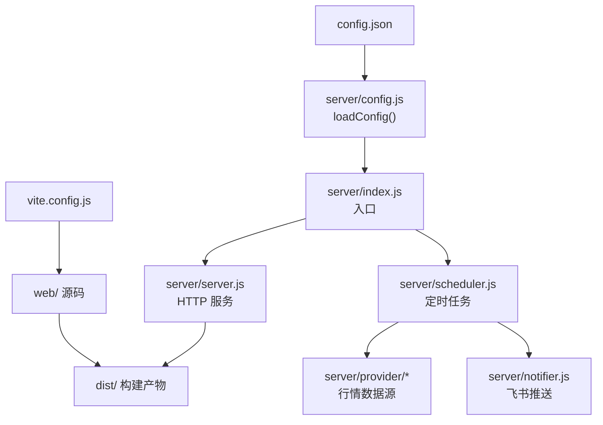
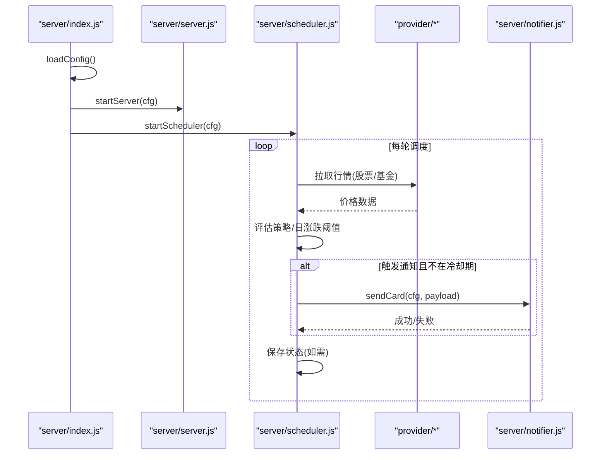
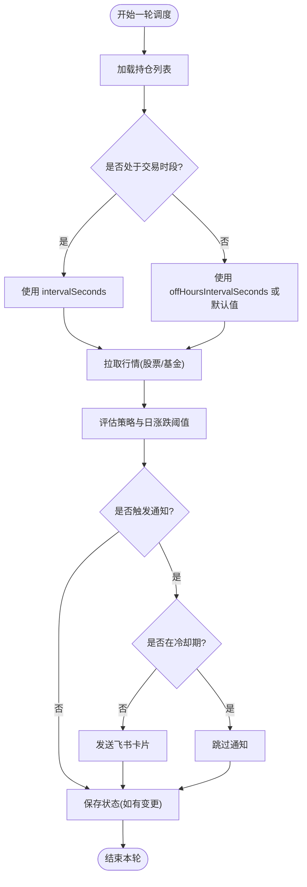
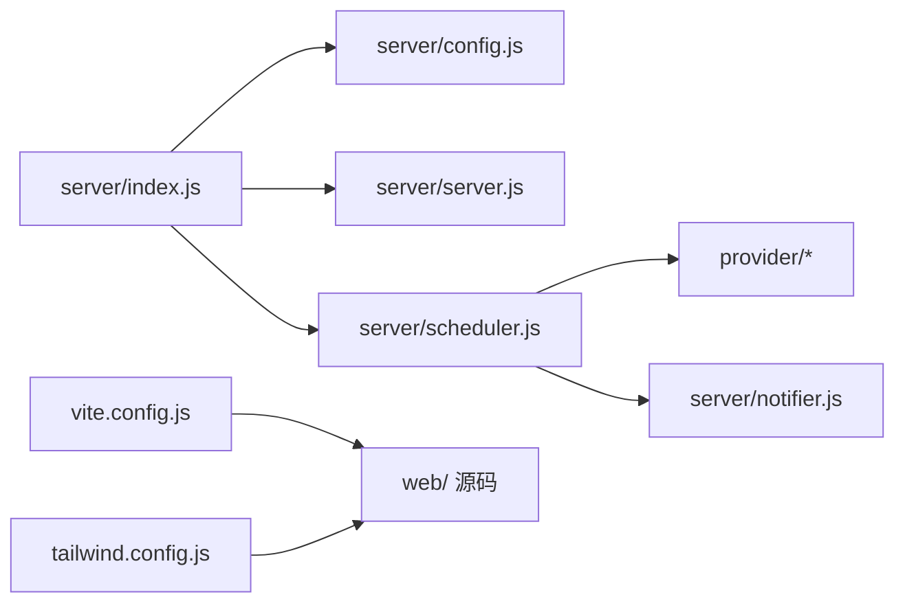

# 配置指南

<cite>
**本文引用的文件**
- [config.json](file://config.json)
- [server/config.js](file://server/config.js)
- [server/index.js](file://server/index.js)
- [server/server.js](file://server/server.js)
- [server/scheduler.js](file://server/scheduler.js)
- [server/notifier.js](file://server/notifier.js)
- [vite.config.js](file://vite.config.js)
- [tailwind.config.js](file://tailwind.config.js)
- [postcss.config.js](file://postcss.config.js)
- [package.json](file://package.json)
- [start.sh](file://start.sh)
</cite>

## 目录
1. [简介](#简介)
2. [项目结构](#项目结构)
3. [核心组件](#核心组件)
4. [架构总览](#架构总览)
5. [详细组件分析](#详细组件分析)
6. [依赖关系分析](#依赖关系分析)
7. [性能考量](#性能考量)
8. [故障排查指南](#故障排查指南)
9. [结论](#结论)
10. [附录：部署与示例](#附录：部署与示例)

## 简介
本指南围绕 Stock Advisor 的配置管理展开，重点解析 config.json 的完整结构与含义，说明服务器、调度器、飞书机器人、通知阈值等关键配置项；阐述环境变量与配置文件的优先级与加载机制；描述前端构建配置（Vite、Tailwind CSS、插件集成）；对比生产与开发环境差异与安全最佳实践；并给出配置验证、热重载思路以及不同部署场景的配置示例。

## 项目结构
Stock Advisor 采用前后端同仓工程：
- 后端 Node.js 服务负责托管静态页面、提供 API、定时抓取行情、执行策略与推送通知。
- 前端 Vue 3 + Vite 在 web/ 目录下开发，构建产物输出到 dist/，由后端统一托管。
- 根目录的 config.json 是运行时配置中心，被后端在服务启动时读取。

图表来源
- [server/config.js:7-10](file://server/config.js#L7-L10)
- [server/index.js:1-17](file://server/index.js#L1-L17)
- [server/server.js:567-593](file://server/server.js#L567-L593)
- [server/scheduler.js:65-178](file://server/scheduler.js#L65-L178)
- [vite.config.js:7-25](file://vite.config.js#L7-L25)

章节来源
- [server/config.js:7-10](file://server/config.js#L7-L10)
- [server/index.js:1-17](file://server/index.js#L1-L17)
- [vite.config.js:7-25](file://vite.config.js#L7-L25)

## 核心组件
- 配置加载器：从根目录读取 config.json 并返回对象。
- HTTP 服务：提供 /api/* 接口与静态资源托管，监听 host/port。
- 调度器：按交易时段选择刷新间隔，拉取行情、评估策略、发送通知。
- 通知器：构造飞书卡片消息，支持 secret 签名与重试。
- 前端构建：Vite 以 web/ 为根，构建到 ../dist，开发时代理 /api 到后端。

章节来源
- [server/config.js:7-10](file://server/config.js#L7-L10)
- [server/server.js:567-593](file://server/server.js#L567-L593)
- [server/scheduler.js:65-178](file://server/scheduler.js#L65-L178)
- [server/notifier.js:81-112](file://server/notifier.js#L81-L112)
- [vite.config.js:7-25](file://vite.config.js#L7-L25)

## 架构总览
后端启动流程：
- 入口加载配置后，启动 HTTP 服务与调度器。
- 调度器循环运行：判断市场是否开市，决定刷新频率；拉取股票/基金价格；计算涨跌与策略触发；冷却期内抑制重复通知；必要时持久化状态。

图表来源
- [server/index.js:1-17](file://server/index.js#L1-L17)
- [server/scheduler.js:65-178](file://server/scheduler.js#L65-L178)
- [server/notifier.js:81-112](file://server/notifier.js#L81-L112)

## 详细组件分析

### 配置文件结构：config.json
config.json 包含以下顶层字段：
- schedule：调度器刷新间隔
  - intervalSeconds：交易时段刷新间隔（秒）
  - offHoursIntervalSeconds：非交易时段刷新间隔（秒），未设置时默认使用固定值
- server：HTTP 服务绑定地址与端口
  - host：监听地址，默认回退到本地回环地址
  - port：监听端口，默认 3000
- feishu：飞书自定义机器人
  - webhook：Webhook 地址
  - secret：可选签名密钥，启用后会生成 timestamp 与 sign
- notify：通知相关
  - cooldownSeconds：同一触发态冷却时间（秒），避免刷屏
  - nearThresholdPct：用于策略评估的“接近阈值”百分比

各字段含义、默认值与取值范围说明：
- schedule.intervalSeconds：正整数，建议不小于 10，过小会频繁请求行情接口。
- schedule.offHoursIntervalSeconds：正整数，未设置时调度器内部使用固定值作为降级间隔。
- server.host：字符串，常用 0.0.0.0（容器/云）或 127.0.0.1（仅本机）。
- server.port：数字，常用 3000，需确保未被占用。
- feishu.webhook：字符串，必须有效。
- feishu.secret：字符串，可选；若配置则启用签名校验。
- notify.cooldownSeconds：正整数，控制告警频率。
- notify.nearThresholdPct：数字，用于策略评估的阈值参数。

章节来源
- [config.json:1-19](file://config.json#L1-L19)
- [server/server.js:567-593](file://server/server.js#L567-L593)
- [server/scheduler.js:58-63](file://server/scheduler.js#L58-L63)
- [server/notifier.js:81-112](file://server/notifier.js#L81-L112)

### 配置加载与环境变量
- 加载位置：server/config.js 中通过相对路径读取根目录 config.json。
- 环境变量：当前实现未读取任何环境变量来覆盖配置；唯一的环境变量 usage 是 server/index.js 中的 process.env.ONCE，用于单次运行模式（只执行一次调度后退出）。
- 优先级：当前代码中不存在环境变量覆盖逻辑，因此 config.json 是唯一配置来源。若需要动态覆盖，可在 loadConfig 中合并 process.env 的值。

章节来源
- [server/config.js:7-10](file://server/config.js#L7-L10)
- [server/index.js:12-16](file://server/index.js#L12-L16)

### 服务器配置
- 监听地址与端口来自 cfg.server.host 与 cfg.server.port，具备默认回退值。
- 静态资源托管：将 dist/ 下的文件映射到根路径，SPA 路由回退到 index.html。
- API 路由：所有 /api/* 交由 handleApi 处理，包括持仓 CRUD、CSV 导入、测试飞书消息等。

章节来源
- [server/server.js:35-53](file://server/server.js#L35-L53)
- [server/server.js:409-565](file://server/server.js#L409-L565)
- [server/server.js:567-593](file://server/server.js#L567-L593)

### 调度器与通知阈值
- 交易时段判断：根据持仓 region 与时区，结合周末与交易时间段判断是否开市。
- 刷新间隔：交易时段使用 schedule.intervalSeconds；非交易时段使用 schedule.offHoursIntervalSeconds 或默认值。
- 行情获取：股票走腾讯行情，基金走基金净值接口，失败时记录日志并跳过该标的。
- 策略评估：调用 evaluate(h, cfg.notify.nearThresholdPct)，根据结果决定是否通知。
- 冷却机制：同一触发态且在 cooldownSeconds 内不重复通知。
- 日涨跌告警：当持仓设置了 dailyDropAlertPct/dailyRiseAlertPct，达到阈值即推送，并按天去重。

图表来源
- [server/scheduler.js:58-63](file://server/scheduler.js#L58-L63)
- [server/scheduler.js:65-178](file://server/scheduler.js#L65-L178)

章节来源
- [server/scheduler.js:58-63](file://server/scheduler.js#L58-L63)
- [server/scheduler.js:65-178](file://server/scheduler.js#L65-L178)

### 飞书机器人配置
- Webhook 必填，secret 可选。
- 若配置了 secret，会在请求体中加入 timestamp 与 sign（HMAC-SHA256），增强安全性。
- 发送失败自动重试最多 3 次，每次递增等待。

章节来源
- [server/notifier.js:81-112](file://server/notifier.js#L81-L112)

### 前端构建配置
- Vite：
  - root: 'web'，构建输出到 '../dist'。
  - 开发服务器 host 为 true（绑定 0.0.0.0），port 5173，/api 代理到 http://127.0.0.1:3000。
- Tailwind CSS：
  - darkMode: 'class'，通过 <html class="dark"> 切换主题。
  - content 指向 web/index.html 与 web/src 下的 Vue/JS 文件。
  - 使用 daisyui 插件，定义 stocklight 与 stockdark 两套主题，darkTheme 指定 stockdark。
- PostCSS：
  - 启用 tailwindcss 与 autoprefixer。

章节来源
- [vite.config.js:7-25](file://vite.config.js#L7-L25)
- [tailwind.config.js:4-53](file://tailwind.config.js#L4-L53)
- [postcss.config.js:1-7](file://postcss.config.js#L1-L7)

### 开发与生产环境差异
- 开发模式：
  - 使用 vite 启动前端开发服务器（:5173），同时启动后端（:3000），/api 自动代理。
  - 适合快速迭代，无需先构建。
- 生产模式：
  - 先构建前端到 dist/，再由后端托管静态资源与 API。
  - 调度器持续运行，按交易时段调整刷新频率。
- 安全最佳实践：
  - 不要将含 secret 的 config.json 提交到版本库；建议使用环境变量注入或外部配置中心。
  - 生产环境建议将 server.host 设置为 0.0.0.0 并通过反向代理暴露，限制端口访问。
  - 对飞书 webhook 启用 secret 签名。

章节来源
- [start.sh:51-99](file://start.sh#L51-L99)
- [server/server.js:567-593](file://server/server.js#L567-L593)
- [server/notifier.js:81-112](file://server/notifier.js#L81-L112)

### 配置验证机制
当前实现未内置类型检查与必填项校验，建议在 loadConfig 中增加：
- 类型检查：确保 schedule.intervalSeconds、schedule.offHoursIntervalSeconds、notify.cooldownSeconds、notify.nearThresholdPct 为正数；server.port 为正整数；feishu.webhook 为非空字符串。
- 必填项验证：校验 feishu.webhook 存在；如启用通知，建议校验 webhook 格式。
- 错误提示：抛出明确错误信息并在入口打印，便于快速定位问题。
- 可考虑引入轻量校验库（如 zod/joi）或在 loadConfig 中手写校验函数。

章节来源
- [server/config.js:7-10](file://server/config.js#L7-L10)
- [server/server.js:567-593](file://server/server.js#L567-L593)

### 配置热重载
当前实现为进程启动时一次性读取 config.json，不支持运行时热重载。可通过以下方式扩展：
- 监听 config.json 文件变更事件（fs.watch），重新加载并更新内存中的配置对象。
- 对外暴露一个管理接口（如 /api/admin/reload-config），触发重新加载并广播给调度器与通知器。
- 注意：热重载期间应避免中断正在进行的调度任务，可采用双缓冲切换配置对象的方式。

章节来源
- [server/config.js:7-10](file://server/config.js#L7-L10)
- [server/index.js:1-17](file://server/index.js#L1-L17)

## 依赖关系分析
- server/index.js 依赖 config.js、scheduler.js、server.js。
- scheduler.js 依赖 store.js、provider/*、strategy.js、notifier.js。
- notifier.js 依赖 crypto（内置模块）。
- vite.config.js 与 tailwind.config.js 仅影响前端构建，不影响运行时行为。

图表来源
- [server/index.js:1-17](file://server/index.js#L1-L17)
- [server/scheduler.js:1-5](file://server/scheduler.js#L1-L5)
- [vite.config.js:7-25](file://vite.config.js#L7-L25)
- [tailwind.config.js:4-53](file://tailwind.config.js#L4-L53)

章节来源
- [server/index.js:1-17](file://server/index.js#L1-L17)
- [server/scheduler.js:1-5](file://server/scheduler.js#L1-L5)

## 性能考量
- 刷新频率：合理设置 schedule.intervalSeconds 与 offHoursIntervalSeconds，避免过短导致上游限流或资源浪费。
- 冷却机制：通过 notify.cooldownSeconds 抑制重复通知，降低网络与存储压力。
- 并行拉取：股票与基金行情并行获取，减少整体延迟。
- 静态资源：生产环境使用构建后的静态文件，减少服务端渲染开销。

[本节为通用指导，不直接分析具体文件]

## 故障排查指南
- 无法启动服务：
  - 检查 Node.js 版本 >= 18（package.json engines）。
  - 确认端口未被占用，必要时修改 server.port。
- 飞书推送失败：
  - 校验 feishu.webhook 是否正确。
  - 若启用 secret，确认签名算法与时间戳一致。
  - 查看日志中的重试与错误信息。
- 无行情数据：
  - 检查网络连通性与上游接口可用性。
  - 关注调度日志中的 “无行情” 警告。
- 前端无法访问 API：
  - 开发模式下确认 /api 代理目标为 :3000。
  - 生产模式下确认 dist/ 已构建且后端托管静态资源。

章节来源
- [package.json:15-17](file://package.json#L15-L17)
- [server/notifier.js:81-112](file://server/notifier.js#L81-L112)
- [server/scheduler.js:72-86](file://server/scheduler.js#L72-L86)
- [vite.config.js:14-23](file://vite.config.js#L14-L23)

## 结论
Stock Advisor 的配置体系以 config.json 为核心，配合后端启动流程与调度器实现自动化行情监控与通知。当前实现简洁稳定，但缺少配置校验与热重载能力。建议在生产环境中加强配置验证、环境变量注入与权限控制，以提升鲁棒性与安全性。

[本节为总结性内容，不直接分析具体文件]

## 附录：部署与示例

### 本地开发
- 使用 start.sh dev 同时启动后端与 Vite 开发服务器。
- 前端通过 :5173 访问，/api 自动代理到 :3000。
- 适用于快速调试与功能验证。

章节来源
- [start.sh:51-77](file://start.sh#L51-L77)
- [vite.config.js:14-23](file://vite.config.js#L14-L23)

### Docker 容器化
- 基础镜像：node >= 18。
- 安装依赖：npm install。
- 构建前端：npm run build。
- 启动服务：npm start。
- 挂载配置：将 config.json 以只读方式挂载到容器内，或通过环境变量注入敏感信息（需改造 loadConfig）。
- 端口映射：将宿主端口映射到容器内的 server.port（默认 3000）。

章节来源
- [package.json:7-13](file://package.json#L7-L13)
- [server/server.js:567-593](file://server/server.js#L567-L593)

### 云部署
- 使用反向代理（Nginx/Caddy）暴露 80/443，并将 /api 转发到后端服务。
- 配置 HTTPS，关闭不必要的端口暴露。
- 将 config.json 放入受控的配置中心或密钥管理服务，避免明文落盘。
- 设置合理的刷新间隔与冷却时间，避免触发上游限流。

章节来源
- [server/server.js:567-593](file://server/server.js#L567-L593)
- [server/scheduler.js:58-63](file://server/scheduler.js#L58-L63)

### 不同场景配置示例（概念性）
- 本地开发：
  - schedule.intervalSeconds: 20
  - schedule.offHoursIntervalSeconds: 300
  - server.host: 127.0.0.1
  - server.port: 3000
  - feishu.webhook: 本地可用地址
  - feishu.secret: 可选
  - notify.cooldownSeconds: 3600
  - notify.nearThresholdPct: 2
- 生产环境：
  - 缩短 intervalSeconds 至合理值（如 30-60），避免频繁请求。
  - 开启 feishu.secret 签名。
  - 将 server.host 设为 0.0.0.0，并通过反向代理暴露。
- 低频监控：
  - 增大 offHoursIntervalSeconds（如 600-900）。
  - 增大 notify.cooldownSeconds（如 7200）。

[本节为概念性示例，不直接分析具体文件]