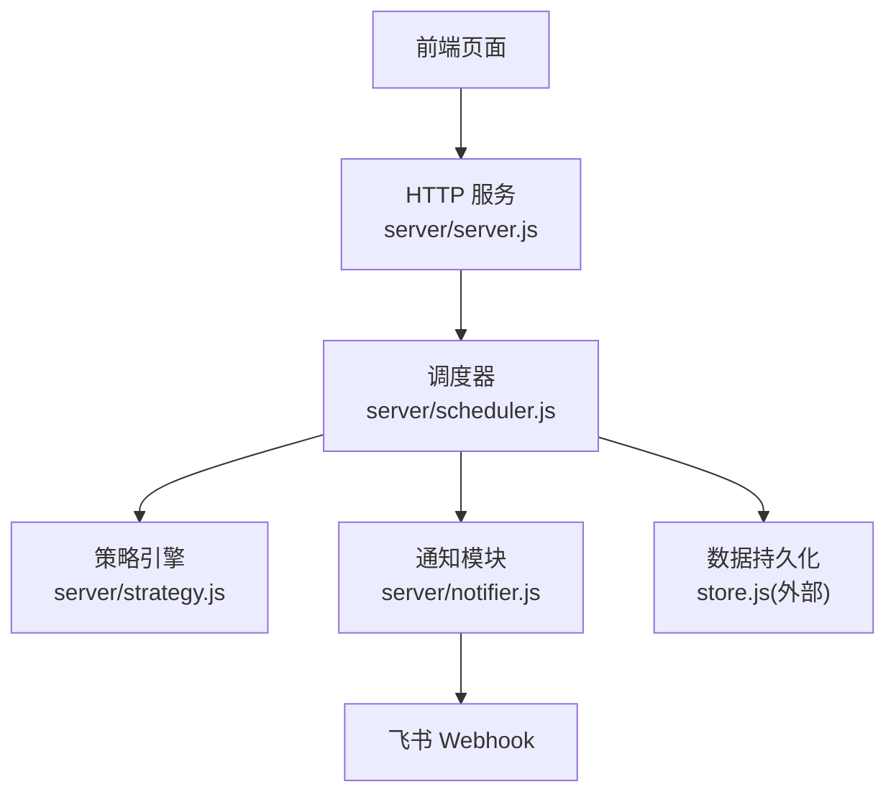
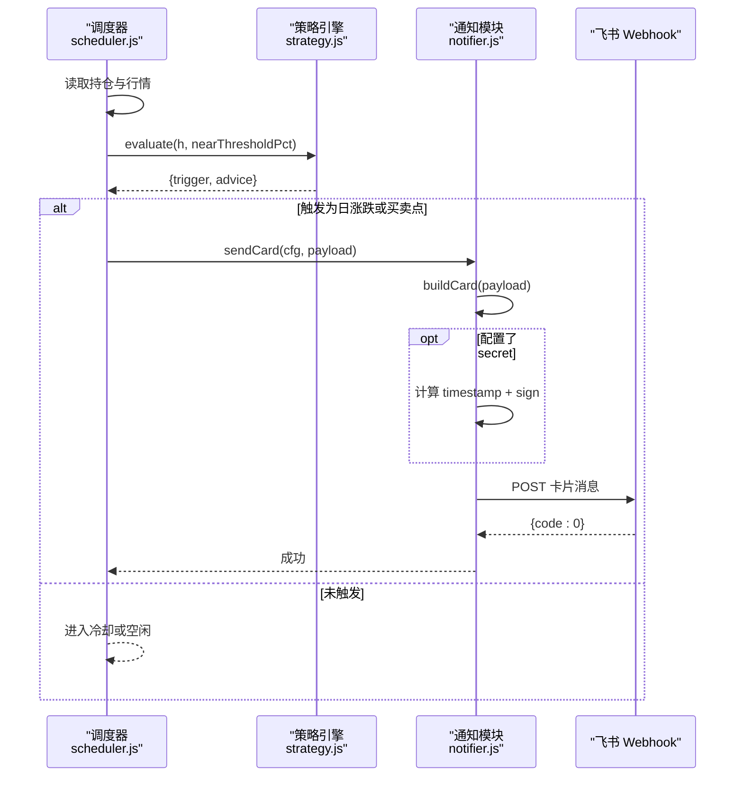
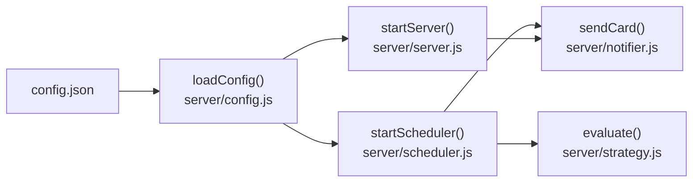

# 飞书机器人配置

<cite>
**本文引用的文件**
- [config.json](file://config.json)
- [server/notifier.js](file://server/notifier.js)
- [server/scheduler.js](file://server/scheduler.js)
- [server/server.js](file://server/server.js)
- [server/config.js](file://server/config.js)
- [server/strategy.js](file://server/strategy.js)
</cite>

## 目录
1. [简介](#简介)
2. [项目结构](#项目结构)
3. [核心组件](#核心组件)
4. [架构总览](#架构总览)
5. [详细组件分析](#详细组件分析)
6. [依赖关系分析](#依赖关系分析)
7. [性能与频率控制](#性能与频率控制)
8. [故障排查指南](#故障排查指南)
9. [结论](#结论)
10. [附录：其他通知渠道集成建议](#附录其他通知渠道集成建议)

## 简介
本文件面向 Stock Advisor 的飞书机器人集成，提供从配置到调试、从消息模板到安全验证的完整说明。重点覆盖：
- feishu 配置段（webhook URL、secret 密钥）的设置方法
- 飞书自定义机器人的创建流程（权限申请、Webhook 配置与安全设置）
- 消息签名验证机制（确保消息完整性与安全性）
- 不同类型通知的消息模板与格式规范
- 调试方法与常见问题解决方案
- 消息频率控制与冷却机制的配置
- 企业微信、钉钉等其他通知渠道的集成思路

## 项目结构
Stock Advisor 的通知能力由后端调度器触发策略评估后，调用通知模块发送飞书卡片消息；前端提供测试接口入口。关键文件职责如下：
- config.json：集中存放 schedule、server、feishu、notify 等运行配置
- server/config.js：加载配置文件
- server/scheduler.js：定时任务、交易时段判断、策略评估、冷却控制、调用通知
- server/notifier.js：构造飞书 interactive 卡片并发送，支持 secret 签名与重试
- server/server.js：HTTP API，包含 /api/test-feishu 测试端点
- server/strategy.js：策略引擎，决定 BUY/SELL/NONE 等触发类型

图表来源
- [server/server.js:567-593](file://server/server.js#L567-L593)
- [server/scheduler.js:65-177](file://server/scheduler.js#L65-L177)
- [server/notifier.js:81-111](file://server/notifier.js#L81-L111)

章节来源
- [config.json:1-19](file://config.json#L1-L19)
- [server/config.js:1-11](file://server/config.js#L1-L11)
- [server/server.js:567-593](file://server/server.js#L567-L593)
- [server/scheduler.js:65-177](file://server/scheduler.js#L65-L177)
- [server/notifier.js:1-112](file://server/notifier.js#L1-L112)
- [server/strategy.js:1-91](file://server/strategy.js#L1-L91)

## 核心组件
- 配置加载：通过 server/config.js 读取根目录 config.json，暴露 schedule、server、feishu、notify 等键
- 调度与冷却：scheduler.js 根据交易时段选择刷新间隔，按持仓维度执行策略评估，并在同一触发态下应用冷却窗口避免刷屏
- 通知发送：notifier.js 将 payload 转换为飞书 interactive 卡片，支持可选 secret 签名，内置最多 3 次重试
- 策略评估：strategy.js 计算成本加权止盈/止损与补仓条件，输出 trigger 与 advice
- 测试接口：server/server.js 暴露 /api/test-feishu 用于快速验证推送链路

章节来源
- [server/config.js:7-10](file://server/config.js#L7-L10)
- [server/scheduler.js:58-177](file://server/scheduler.js#L58-L177)
- [server/notifier.js:4-111](file://server/notifier.js#L4-L111)
- [server/strategy.js:34-90](file://server/strategy.js#L34-L90)
- [server/server.js:545-562](file://server/server.js#L545-L562)

## 架构总览
下图展示一次“日涨跌告警”或“买卖点提醒”的端到端流程：调度器拉取行情、评估策略、生成卡片、签名并发送到飞书。

图表来源
- [server/scheduler.js:101-157](file://server/scheduler.js#L101-L157)
- [server/notifier.js:4-111](file://server/notifier.js#L4-L111)

## 详细组件分析

### 飞书配置段（feishu）
- webhook：飞书自定义机器人 Webhook 地址，用于接收消息
- secret：可选的安全密钥，启用后将附加 timestamp 与 sign 字段进行签名校验

配置位置与键名：
- 路径：config.json
- 键：feishu.webhook、feishu.secret

使用方式：
- notifier.js 在发送前读取 cfg.feishu，若存在 secret，则计算签名并注入 body.timestamp 与 body.sign
- scheduler.js 与 server/server.js 通过统一配置对象传入 notifier

章节来源
- [config.json:10-13](file://config.json#L10-L13)
- [server/notifier.js:81-94](file://server/notifier.js#L81-L94)

### 飞书自定义机器人创建流程
- 权限申请：在飞书开放平台或群聊中创建“自定义机器人”，获取 Webhook 地址
- Webhook 配置：将生成的 Webhook 填入 config.json 的 feishu.webhook
- 安全设置：如需开启签名校验，在飞书机器人设置中启用“签名校验”，并将相同密钥填入 config.json 的 feishu.secret

注意：
- 若未配置 secret，则不附加签名字段
- 若配置了 secret，必须保证服务端与飞书侧的密钥一致，否则会被拒绝

章节来源
- [config.json:10-13](file://config.json#L10-L13)
- [server/notifier.js:81-94](file://server/notifier.js#L81-L94)

### 消息签名验证机制
- 签名输入：timestamp（当前秒级时间戳）与 secret
- 签名算法：HMAC-SHA256，对字符串 “timestamp\nsecret” 进行签名，结果为 base64
- 附加字段：body.timestamp、body.sign
- 校验时机：飞书服务端收到消息后使用相同 secret 校验签名与时间戳

实现要点：
- 时间戳来源于 Date.now() 的秒级整数
- 使用 Node 标准库 crypto.createHmac('sha256', stringToSign).update('').digest('base64')
- 若未配置 secret，则跳过签名步骤

章节来源
- [server/notifier.js:85-94](file://server/notifier.js#L85-L94)

### 消息模板与格式规范
所有通知均使用飞书 interactive 卡片（msg_type: 'interactive'），不同触发类型对应不同标题与内容：
- 日涨跌告警（DAILY_RISE / DAILY_DROP）
  - 标题：【日涨跌告警 · 大涨】或【日涨跌告警 · 大跌】
  - 头部模板色：上涨用红色，下跌用黄色
  - 字段：品种、代码、市场/类型、当前价
  - 详情：advice 文本
  - 备注：股票秘书 · summary
- 买点提醒（BUY）
  - 标题：【买点提醒 · 补仓】
  - 头部模板色：绿色
  - 字段：同上
  - 详情：操作建议
  - 备注：股票秘书 · summary
- 卖点提醒（SELL）
  - 标题：【卖点提醒 · 止盈】
  - 头部模板色：红色
  - 字段：同上
  - 详情：操作建议
  - 备注：股票秘书 · summary

payload 关键字段：
- name、code、region、type、currentPrice、advice、summary、trigger

章节来源
- [server/notifier.js:4-78](file://server/notifier.js#L4-L78)
- [server/scheduler.js:114-120](file://server/scheduler.js#L114-L120)
- [server/scheduler.js:144-153](file://server/scheduler.js#L144-L153)

### 调度与冷却机制
- 交易时段降频：非交易时段使用更长的刷新间隔，减少不必要请求
- 冷却窗口：同一触发态且在 cooldownSeconds 内不再重复推送，避免刷屏
- 每日涨跌告警：按日期去重，同一天只推送一次

配置项：
- schedule.intervalSeconds：交易时段刷新间隔（秒）
- schedule.offHoursIntervalSeconds：非交易时段刷新间隔（秒）
- notify.cooldownSeconds：冷却窗口（秒）
- notify.nearThresholdPct：接近阈值百分比（用于“快达到”提示）

章节来源
- [config.json:2-5](file://config.json#L2-L5)
- [config.json:14-17](file://config.json#L14-L17)
- [server/scheduler.js:58-63](file://server/scheduler.js#L58-L63)
- [server/scheduler.js:135-141](file://server/scheduler.js#L135-L141)
- [server/scheduler.js:101-124](file://server/scheduler.js#L101-L124)

### 测试与调试
- 测试接口：POST /api/test-feishu，会发送一条“买点提醒”类型的测试卡片
- 前端触发：前端按钮可调用该接口，便于快速验证 Webhook 与签名是否生效
- 错误处理：notifier.js 内置最多 3 次重试，失败时抛出错误；server.js 返回 502 并附带错误信息

调试步骤：
1. 在 config.json 中填写正确的 feishu.webhook 与 feishu.secret（如启用）
2. 启动服务后访问前端页面，点击“测试飞书”按钮
3. 观察控制台日志与飞书群消息
4. 若失败，检查网络连通性、Webhook 有效性、secret 一致性

章节来源
- [server/server.js:545-562](file://server/server.js#L545-L562)
- [server/notifier.js:96-111](file://server/notifier.js#L96-L111)

## 依赖关系分析
- server/server.js 依赖 notifier.js 提供 sendCard
- server/scheduler.js 依赖 strategy.js 做策略评估，依赖 notifier.js 发送通知
- server/config.js 提供统一的配置加载
- config.json 是运行时配置的唯一来源

图表来源
- [server/config.js:7-10](file://server/config.js#L7-L10)
- [server/server.js:567-593](file://server/server.js#L567-L593)
- [server/scheduler.js:65-177](file://server/scheduler.js#L65-L177)
- [server/notifier.js:81-111](file://server/notifier.js#L81-L111)

章节来源
- [server/config.js:1-11](file://server/config.js#L1-L11)
- [server/server.js:567-593](file://server/server.js#L567-L593)
- [server/scheduler.js:65-177](file://server/scheduler.js#L65-L177)
- [server/notifier.js:81-111](file://server/notifier.js#L81-L111)

## 性能与频率控制
- 交易时段与非交易时段差异化刷新：降低非交易时段的请求频率，节省资源
- 冷却窗口：基于 notifiedAt 与 triggerState 的组合，避免短时间内重复推送
- 重试机制：发送失败时指数退避式重试（1s、2s、3s），提高稳定性
- 近阈值提示：nearThresholdPct 允许在接近止盈/止损时提前提醒，减少错过机会

优化建议：
- 合理设置 cooldownSeconds，平衡及时性与噪音
- 根据业务量调整 schedule.intervalSeconds 与 offHoursIntervalSeconds
- 监控飞书 Webhook 响应码与错误日志，定位异常

章节来源
- [server/scheduler.js:58-63](file://server/scheduler.js#L58-L63)
- [server/scheduler.js:135-141](file://server/scheduler.js#L135-L141)
- [server/notifier.js:96-111](file://server/notifier.js#L96-L111)
- [config.json:2-5](file://config.json#L2-L5)
- [config.json:14-17](file://config.json#L14-L17)

## 故障排查指南
常见问题与解决：
- 飞书返回 code !== 0：检查 Webhook 是否正确、secret 是否一致、网络是否可达
- 签名校验失败：确认已启用签名且 secret 与服务端一致；检查时间戳是否同步
- 频繁刷屏：增大 cooldownSeconds，或减少触发条件敏感度
- 无消息推送：确认调度器正常运行、持仓状态为“持有”、有有效行情数据
- 测试接口失败：查看 /api/test-feishu 返回的错误信息，核对配置与网络

定位手段：
- 查看控制台日志中的 [notify]、[notify-daily]、[server] 等标记
- 使用 /api/test-feishu 快速验证链路
- 逐步关闭 secret 以排除签名问题

章节来源
- [server/notifier.js:96-111](file://server/notifier.js#L96-L111)
- [server/server.js:545-562](file://server/server.js#L545-L562)
- [server/scheduler.js:101-157](file://server/scheduler.js#L101-L157)

## 结论
Stock Advisor 的飞书机器人集成通过简洁的配置与健壮的实现，提供了稳定的交易提醒能力。借助 interactive 卡片、签名校验与冷却机制，既能保证消息的可读性与安全性，又能避免通知风暴。建议在生产环境结合业务量合理调优频率与冷却参数，并通过测试接口持续验证链路健康。

## 附录：其他通知渠道集成建议
当前仓库仅实现了飞书通知。如需扩展至企业微信、钉钉等渠道，可参考以下思路：
- 新增通知适配器：在不改动现有调度器的情况下，新增独立的 sendWeCom、sendDingTalk 函数，复用 notifier.js 的重试与错误处理模式
- 统一配置：在 config.json 中增加 wecom、dingtalk 等配置段，分别维护各自的 webhook 与密钥
- 消息适配：针对不同平台的消息体格式，构建对应的卡片或富文本消息
- 触发策略：可在 scheduler.js 中并行或串行调用多个通知适配器，或在 notifier.js 中抽象出多通道分发逻辑

注意：以上为概念性建议，具体实现需依据各平台 API 文档与项目需求进行开发。