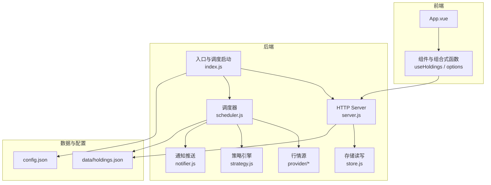
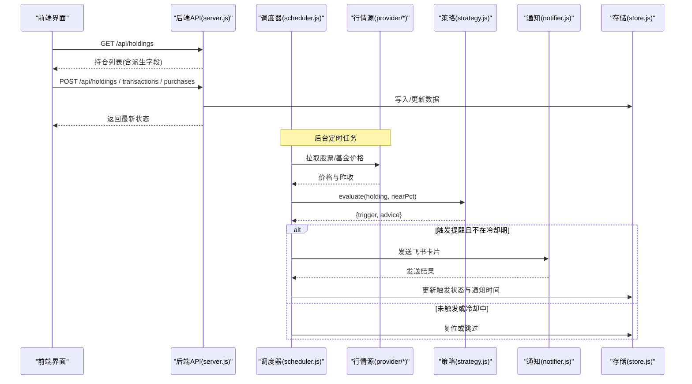
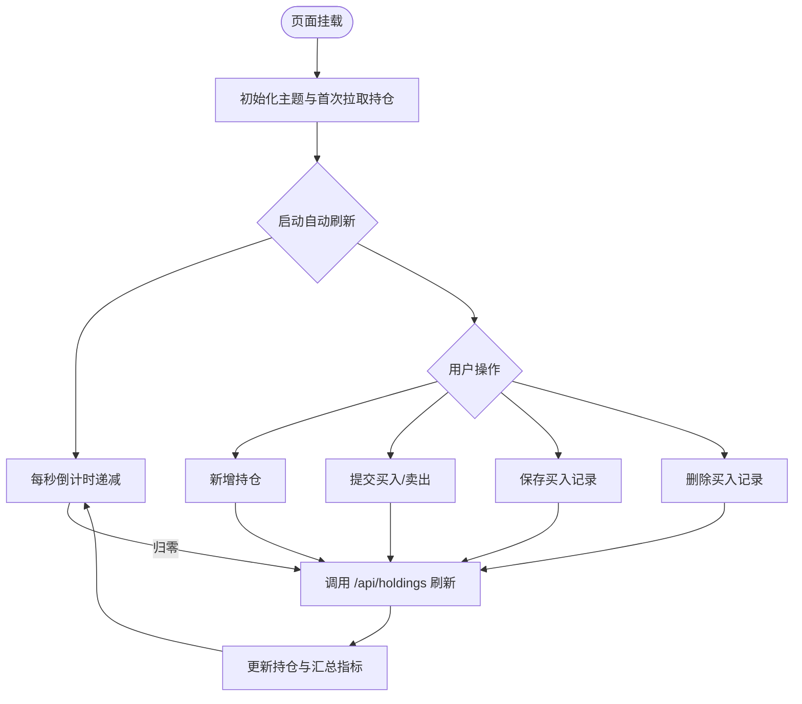
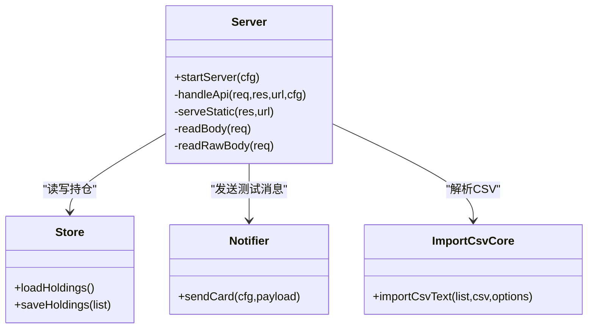
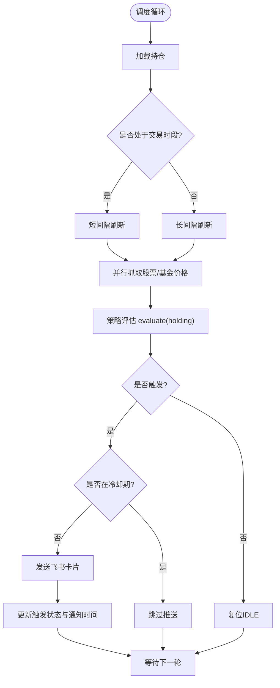
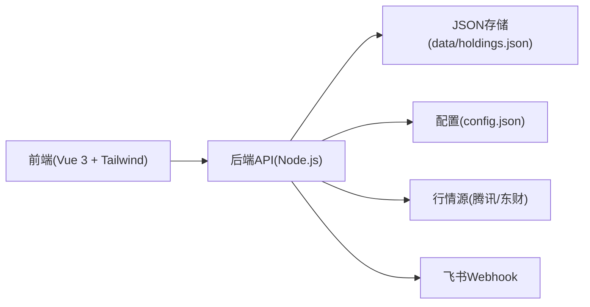

# 项目概述

<cite>
**本文引用的文件**
- [package.json](file://package.json)
- [config.json](file://config.json)
- [server/index.js](file://server/index.js)
- [server/server.js](file://server/server.js)
- [server/scheduler.js](file://server/scheduler.js)
- [server/strategy.js](file://server/strategy.js)
- [web/src/main.js](file://web/src/main.js)
- [web/src/App.vue](file://web/src/App.vue)
- [web/src/composables/useHoldings.js](file://web/src/composables/useHoldings.js)
- [web/src/constants/options.js](file://web/src/constants/options.js)
- [data/holdings.json](file://data/holdings.json)
- [start.sh](file://start.sh)
- [docs/项目计划.md](file://docs/项目计划.md)
</cite>

## 目录
1. [简介](#简介)
2. [项目结构](#项目结构)
3. [核心组件](#核心组件)
4. [架构总览](#架构总览)
5. [详细组件分析](#详细组件分析)
6. [依赖关系分析](#依赖关系分析)
7. [性能与调度特性](#性能与调度特性)
8. [故障排查指南](#故障排查指南)
9. [结论](#结论)
10. [附录：技术栈与运行方式](#附录技术栈与运行方式)

## 简介
Stock Advisor（股票秘书）是一个面向个人投资者的多市场投资组合管理工具，集持仓记录、实时行情监控与智能提醒于一体。系统支持A股、港股、美股等市场的股票与基金，通过定时抓取行情、策略引擎评估买点/卖点，并借助飞书机器人推送结构化提醒，帮助用户降低投资风险、提升交易纪律性。

核心价值：
- 统一管理多市场持仓与交易明细，自动计算成本、收益与风险指标
- 基于阈值与策略的自动化提醒，减少情绪化决策
- 前后端分离的现代Web应用，便于扩展与维护

主要用例：
- 新增/编辑持仓与买入卖出记录，查看实时盈亏与今日涨跌
- 设置止盈/止损、补仓条件与日涨跌告警阈值
- 接收飞书消息提醒，及时执行交易或风控动作

目标用户：
- 个人投资者、家庭资产配置者、小型投研团队

使用场景：
- 日常盯盘与收益跟踪
- 多市场组合的风险预警与操作建议
- 批量导入历史交易数据，快速重建持仓视图

## 项目结构
项目采用前后端分离架构：
- 前端：Vue 3 + Tailwind CSS + Vite，提供交互式持仓管理与可视化概览
- 后端：Node.js 原生 HTTP 服务，承载 API、静态资源托管、行情调度与通知推送
- 数据：本地 JSON 文件持久化持仓与交易记录
- 配置：外部 JSON 配置文件控制刷新频率、服务器端口、飞书 Webhook 与冷却策略

图表来源
- [server/index.js:1-17](file://server/index.js#L1-L17)
- [server/server.js:567-594](file://server/server.js#L567-L594)
- [server/scheduler.js:65-178](file://server/scheduler.js#L65-L178)
- [server/strategy.js:34-90](file://server/strategy.js#L34-L90)
- [config.json:1-19](file://config.json#L1-L19)
- [data/holdings.json:1-462](file://data/holdings.json#L1-L462)

章节来源
- [package.json:1-32](file://package.json#L1-L32)
- [start.sh:1-100](file://start.sh#L1-L100)
- [web/src/App.vue:1-197](file://web/src/App.vue#L1-L197)
- [web/src/composables/useHoldings.js:1-154](file://web/src/composables/useHoldings.js#L1-L154)
- [web/src/constants/options.js:1-33](file://web/src/constants/options.js#L1-L33)
- [server/index.js:1-17](file://server/index.js#L1-L17)
- [server/server.js:1-594](file://server/server.js#L1-L594)
- [server/scheduler.js:1-178](file://server/scheduler.js#L1-L178)
- [server/strategy.js:1-91](file://server/strategy.js#L1-L91)
- [config.json:1-19](file://config.json#L1-L19)
- [data/holdings.json:1-462](file://data/holdings.json#L1-L462)

## 核心组件
- 前端应用层
  - App.vue：页面编排、主题切换、过滤与弹窗控制、触发飞书测试
  - useHoldings：统一状态与API调用，自动刷新倒计时、汇总统计、增删改查
  - constants/options：策略、地区、类型枚举与刷新间隔常量
- 后端服务层
  - server.js：HTTP路由、静态资源托管、持仓CRUD、CSV导入、派生字段计算
  - scheduler.js：按市场时区判断交易时段、定时抓取行情、策略评估、冷却与通知
  - strategy.js：基于成本加权与最近买入价的止盈/止损/补仓判断
  - notifier.js：飞书卡片消息封装与发送
  - store.js：JSON文件读写（由其他模块引用）
- 数据与配置
  - data/holdings.json：持仓、买入/卖出记录、策略参数与状态
  - config.json：刷新间隔、服务器地址、飞书Webhook与冷却时间

章节来源
- [web/src/App.vue:1-197](file://web/src/App.vue#L1-L197)
- [web/src/composables/useHoldings.js:1-154](file://web/src/composables/useHoldings.js#L1-L154)
- [web/src/constants/options.js:1-33](file://web/src/constants/options.js#L1-L33)
- [server/server.js:1-594](file://server/server.js#L1-L594)
- [server/scheduler.js:1-178](file://server/scheduler.js#L1-L178)
- [server/strategy.js:1-91](file://server/strategy.js#L1-L91)
- [config.json:1-19](file://config.json#L1-L19)
- [data/holdings.json:1-462](file://data/holdings.json#L1-L462)

## 架构总览
系统采用“前端单页应用 + 后端轻量HTTP服务”的分层架构：
- 前端通过REST接口获取持仓列表与执行交易操作，同时维护本地状态与自动刷新计时器
- 后端提供统一的API，负责数据持久化、派生指标计算、策略评估与通知推送
- 调度器根据市场交易时段动态调整刷新频率，避免非交易时段的无效请求
- 策略引擎以成本加权与最近买入价为基准，输出买点/卖点信号并附带建议文案
- 通知模块将结构化卡片推送到飞书机器人，支持冷却与去重

图表来源
- [server/server.js:409-565](file://server/server.js#L409-L565)
- [server/scheduler.js:65-178](file://server/scheduler.js#L65-L178)
- [server/strategy.js:34-90](file://server/strategy.js#L34-L90)

## 详细组件分析

### 前端应用（Vue 3 + Tailwind）
- 页面组织：App.vue聚合头部、概览卡片、持仓列表与多个弹窗（新增、交易、买入记录、CSV导入）
- 状态管理：useHoldings维护全局持仓、加载态、错误信息、倒计时与汇总指标；提供刷新、添加、交易提交、保存买入记录、删除买入记录、更新持仓级字段等方法
- 过滤与展示：支持按类型与市场多选过滤，地区标签映射，收益正负颜色遵循A股习惯
- 交互能力：顶部倒计时环形指示自动刷新进度，一键刷新与测试飞书推送

图表来源
- [web/src/App.vue:1-197](file://web/src/App.vue#L1-L197)
- [web/src/composables/useHoldings.js:1-154](file://web/src/composables/useHoldings.js#L1-L154)
- [web/src/constants/options.js:1-33](file://web/src/constants/options.js#L1-L33)

章节来源
- [web/src/App.vue:1-197](file://web/src/App.vue#L1-L197)
- [web/src/composables/useHoldings.js:1-154](file://web/src/composables/useHoldings.js#L1-L154)
- [web/src/constants/options.js:1-33](file://web/src/constants/options.js#L1-L33)

### 后端服务（Node.js HTTP）
- 路由与静态托管：/api/*处理业务接口，其余GET请求托管dist下的前端静态资源，SPA兜底到index.html
- 持仓CRUD：创建持仓、追加买入记录、修改买入记录、删除买入记录、交易提交（兼容旧接口）、更新持仓级字段（如日涨跌告警阈值）
- 派生计算：为每条持仓计算成本、均价、市值、持仓收益、今日收益、最近买入价、成本加权止盈/止损等
- CSV导入：解析CSV文本，按代码匹配已有明细，缺失项可插入，支持createMissing模式
- 飞书测试：提供测试接口用于验证Webhook连通性与消息模板

图表来源
- [server/server.js:1-594](file://server/server.js#L1-L594)

章节来源
- [server/server.js:1-594](file://server/server.js#L1-L594)

### 调度与策略（定时任务 + 策略引擎）
- 市场时段判断：依据各市场时区与交易时间段，区分交易时段与非交易时段，动态选择刷新间隔
- 行情抓取：股票走腾讯行情，基金走东方财富净值接口，失败降级并保留上次成功值
- 策略评估：
  - 卖点：达到预期止盈（成本加权），或任一买入记录触及止损线
  - 买点：较最近买入价跌幅接近补仓条件，或触及补仓价
  - 近阈值提示：nearThresholdPct允许在接近阈值时提前提示
- 冷却机制：同一触发态且在冷却窗口内不重复推送，避免刷屏
- 日涨跌告警：按持仓级阈值对当日涨跌幅进行告警，每日仅推送一次

图表来源
- [server/scheduler.js:1-178](file://server/scheduler.js#L1-L178)
- [server/strategy.js:1-91](file://server/strategy.js#L1-L91)
- [config.json:1-19](file://config.json#L1-L19)

章节来源
- [server/scheduler.js:1-178](file://server/scheduler.js#L1-L178)
- [server/strategy.js:1-91](file://server/strategy.js#L1-L91)
- [config.json:1-19](file://config.json#L1-L19)

### 数据模型与示例
- holdings.json包含多只股票与基金的完整持仓、多次买入记录、卖出记录、策略参数与状态字段
- 字段覆盖：名称、代码、市场、类型、策略、快照信息、仓位、买入/卖出明细、补仓条件、日涨跌告警阈值、当前价、昨收、最后更新时间、触发状态与通知时间、派生指标（成本、均价、市值、收益等）

章节来源
- [data/holdings.json:1-462](file://data/holdings.json#L1-L462)

## 依赖关系分析
- 前端依赖Vue 3与Tailwind生态，通过Vite构建与开发服务器提供热更新
- 后端依赖Node.js内置http/fs模块，无重型框架，保持轻量与可控
- 外部依赖：
  - 行情源：腾讯财经（股票）、东方财富（基金净值）
  - 通知渠道：飞书自定义机器人Webhook
- 运行时依赖：Node.js >= 18

图表来源
- [package.json:1-32](file://package.json#L1-L32)
- [config.json:1-19](file://config.json#L1-L19)
- [server/server.js:1-594](file://server/server.js#L1-L594)

章节来源
- [package.json:1-32](file://package.json#L1-L32)
- [config.json:1-19](file://config.json#L1-L19)
- [server/server.js:1-594](file://server/server.js#L1-L594)

## 性能与调度特性
- 动态刷新间隔：交易时段短间隔（默认20秒），非交易时段降频至300秒，降低无效请求与资源消耗
- 并行抓取：股票与基金价格并行拉取，缩短整体延迟
- 冷却与去重：同一触发态在冷却期内不重复推送，避免消息风暴
- 失败降级：行情抓取失败不影响已缓存价格，保证前端显示稳定
- 前端单定时器：避免多定时器漂移，确保倒计时与刷新节奏一致

[本节为通用性能讨论，不直接分析具体文件]

## 故障排查指南
- 无法获取行情
  - 检查网络与第三方API可用性
  - 查看调度日志中的抓取错误与跳过提示
  - 确认持仓的市场与代码格式正确
- 飞书推送失败
  - 使用前端“测试飞书”功能验证Webhook连通性
  - 检查config.json中的webhook与secret配置
  - 关注冷却时间配置，避免频繁触发被限流
- 数据不一致
  - 核对CSV导入规则与createMissing选项
  - 检查交易提交后是否成功同步并刷新列表
- 启动问题
  - 确认Node.js版本>=18
  - 生产模式需先构建前端产物（npm run build）
  - 开发模式可通过start.sh dev同时启动后端与Vite

章节来源
- [server/scheduler.js:65-178](file://server/scheduler.js#L65-L178)
- [server/server.js:545-565](file://server/server.js#L545-L565)
- [config.json:1-19](file://config.json#L1-L19)
- [start.sh:1-100](file://start.sh#L1-L100)

## 结论
Stock Advisor以简洁可靠的架构实现了个人投资助手的核心能力：多市场持仓管理、实时行情监控与智能提醒。通过策略引擎与冷却机制，系统在降低误报的同时提供及时的买卖建议；前后端分离的设计使系统易于扩展与维护。配合飞书机器人，用户可在移动端即时获知关键信号，提升投资决策效率与风险控制能力。

[本节为总结性内容，不直接分析具体文件]

## 附录：技术栈与运行方式
- 技术栈
  - 前端：Vue 3、Tailwind CSS、Vite
  - 后端：Node.js（原生http/fs）、ES模块
  - 数据：JSON文件持久化
  - 外部服务：腾讯财经、东方财富、飞书机器人
- 运行方式
  - 生产模式：./start.sh（自动构建前端并启动后端，访问 http://127.0.0.1:3000）
  - 开发模式：./start.sh dev（后端:3000 + Vite HMR:5173，/api代理到后端）
  - 环境变量：ONCE=1 可单次运行调度任务后退出

章节来源
- [package.json:1-32](file://package.json#L1-L32)
- [start.sh:1-100](file://start.sh#L1-L100)
- [server/index.js:1-17](file://server/index.js#L1-L17)
- [docs/项目计划.md:1-108](file://docs/项目计划.md#L1-L108)